# System Architecture Diagram

**Purpose:** Shows the overall system architecture of the Azure Document Management System

**Last Updated:** 2025-09-30

**Version:** 1.0.0

## High-Level Architecture

```mermaid
graph TB
    subgraph "Client Layer"
        USER[👤 Users]
        DESKTOP[🖥️ Desktop Browser]
        MOBILE[📱 Mobile Browser]
    end

    subgraph "Presentation Layer - Azure Static Web Apps"
        VUE[Vue 3 SPA<br/>Vuetify + Pinia]
        CDN[Azure CDN]
    end

    subgraph "API Layer - Azure Functions"
        APIGW[API Gateway<br/>API Management]
        DOCFN[Document Functions<br/>Upload/Download/CRUD]
        FOLDFN[Folder Functions<br/>Tree/CRUD]
        SEARCHFN[Search Function]
    end

    subgraph "Service Layer"
        COSMOSSVC[Cosmos DB Service]
        BLOBSVC[Blob Storage Service]
        CACHESVC[Cache Service]
    end

    subgraph "Data Layer - Azure Services"
        COSMOS[(Cosmos DB<br/>NoSQL)]
        BLOB[Blob Storage<br/>Documents]
        REDIS[(Redis Cache)]
    end

    subgraph "Security & Monitoring"
        KEYVAULT[🔐 Key Vault]
        APPINSIGHTS[📊 App Insights]
    end

    USER --> DESKTOP
    USER --> MOBILE
    DESKTOP --> CDN
    MOBILE --> CDN
    CDN --> VUE

    VUE -->|HTTPS REST API| APIGW
    APIGW --> DOCFN
    APIGW --> FOLDFN
    APIGW --> SEARCHFN

    DOCFN --> COSMOSSVC
    DOCFN --> BLOBSVC
    DOCFN --> CACHESVC

    FOLDFN --> COSMOSSVC
    FOLDFN --> CACHESVC

    SEARCHFN --> COSMOSSVC
    SEARCHFN --> CACHESVC

    COSMOSSVC --> COSMOS
    BLOBSVC --> BLOB
    CACHESVC --> REDIS

    DOCFN -.->|Secrets| KEYVAULT
    FOLDFN -.->|Secrets| KEYVAULT
    SEARCHFN -.->|Secrets| KEYVAULT

    DOCFN -.->|Telemetry| APPINSIGHTS
    FOLDFN -.->|Telemetry| APPINSIGHTS
    SEARCHFN -.->|Telemetry| APPINSIGHTS
    VUE -.->|Analytics| APPINSIGHTS

    classDef clientStyle fill:#e1f5ff,stroke:#01579b,stroke-width:2px
    classDef frontendStyle fill:#c8e6c9,stroke:#2e7d32,stroke-width:2px
    classDef apiStyle fill:#fff9c4,stroke:#f57f17,stroke-width:2px
    classDef serviceStyle fill:#f8bbd0,stroke:#c2185b,stroke-width:2px
    classDef dataStyle fill:#d1c4e9,stroke:#512da8,stroke-width:2px
    classDef securityStyle fill:#ffccbc,stroke:#d84315,stroke-width:2px

    class USER,DESKTOP,MOBILE clientStyle
    class VUE,CDN frontendStyle
    class APIGW,DOCFN,FOLDFN,SEARCHFN apiStyle
    class COSMOSSVC,BLOBSVC,CACHESVC serviceStyle
    class COSMOS,BLOB,REDIS dataStyle
    class KEYVAULT,APPINSIGHTS securityStyle
```

## Key Components

### Client Layer
- **Users**: Knowledge workers, administrators, executives accessing the system
- **Desktop Browser**: Primary interface for full-featured access
- **Mobile Browser**: Responsive interface for on-the-go access

### Presentation Layer
- **Vue 3 SPA**: Single-page application with Vuetify Material Design components and Pinia state management
- **Azure CDN**: Content delivery network for fast global access

### API Layer
- **API Gateway**: Azure API Management for authentication, rate limiting, and routing
- **Document Functions**: Handle document upload, download, metadata CRUD operations
- **Folder Functions**: Manage folder hierarchy, tree structure, and navigation
- **Search Function**: Full-text search with filtering and caching

### Service Layer
- **Cosmos DB Service**: Abstract database operations with repository pattern
- **Blob Storage Service**: Handle file uploads, downloads, and SAS token generation
- **Cache Service**: Redis operations for performance optimization

### Data Layer
- **Cosmos DB**: NoSQL database for metadata (documents, folders, tags)
- **Blob Storage**: Cost-effective storage for large document files
- **Redis Cache**: In-memory cache for folder trees, search results, and frequently accessed data

### Security & Monitoring
- **Key Vault**: Secure storage for connection strings and API keys
- **App Insights**: Application performance monitoring and analytics

## Data Flow

1. **User Request**: User interacts with Vue 3 frontend
2. **API Call**: Frontend makes HTTPS REST API call to Azure Functions
3. **Authentication**: API Gateway validates API key/token
4. **Function Processing**: Azure Function executes business logic
5. **Cache Check**: Function checks Redis cache for data
6. **Data Retrieval**: If not cached, function queries Cosmos DB or Blob Storage
7. **Cache Update**: Function updates Redis cache with results
8. **Response**: Function returns data to frontend
9. **Telemetry**: All operations logged to Application Insights

## Security Boundaries

- All communication over HTTPS/TLS 1.2+
- API authentication at gateway level
- Azure Managed Identities between services
- Secrets stored in Key Vault
- Private endpoints for production (Cosmos DB, Storage)
- CORS configuration for allowed origins

## Scalability Considerations

- **Serverless Functions**: Auto-scale based on demand
- **Cosmos DB**: Provisioned throughput with auto-scaling
- **Blob Storage**: Virtually unlimited storage
- **Redis Cache**: Can scale to Premium tier for clustering
- **CDN**: Global distribution for frontend assets

## Notes

- POC uses API key authentication (no user-level security)
- All Azure services in same region for low latency
- Redis cache reduces load on Cosmos DB by 60-80%
- Blob Storage lifecycle policies move old files to Cool tier
- Application Insights provides end-to-end request tracking
