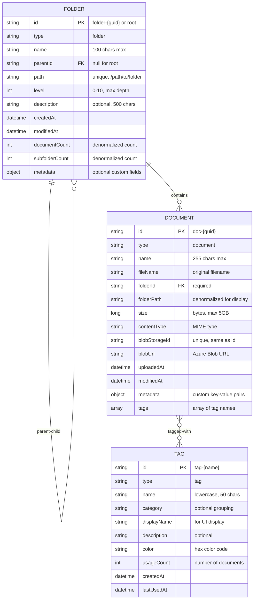

# Entity Relationship Diagram (ERD)

**Purpose:** Shows the Cosmos DB database structure and relationships

**Last Updated:** 2025-09-30

**Version:** 1.0.0

## Cosmos DB Entity Relationship Diagram



## Container Partitioning Strategy

### Container: `documents`
- **Partition Key**: `/folderId`
- **Rationale**: Most queries filter by folder, enables efficient folder listing
- **Benefits**: Co-locates all documents in same folder on same partition

### Container: `folders`
- **Partition Key**: `/parentId`
- **Rationale**: Optimizes parent-child queries and tree traversal
- **Benefits**: All children of a folder on same partition

### Container: `tags`
- **Partition Key**: `/category`
- **Rationale**: Allows tag categorization and grouping
- **Benefits**: Can organize tags by department, type, etc.

## Relationships

### Folder → Folder (Self-Referencing)
- **Type**: One-to-Many (parent to children)
- **Cardinality**: 1:N
- **Foreign Key**: `parentId` references `id`
- **Constraints**:
  - Root folder has `parentId = null`
  - Cannot create circular references
  - Maximum depth: 10 levels
  - Cannot move folder to its own descendant

### Folder → Document
- **Type**: One-to-Many
- **Cardinality**: 1:N
- **Foreign Key**: `folderId` references folder `id`
- **Constraints**:
  - Each document must belong to exactly one folder
  - Folder cannot be deleted if it contains documents (unless force flag)
  - Moving document updates `folderId` and `folderPath`

### Document → Tag
- **Type**: Many-to-Many (soft relationship)
- **Cardinality**: N:M
- **Implementation**: Array of tag names in document
- **Constraints**:
  - Tags stored as string array in document
  - Maximum 50 tags per document
  - Tag names are case-insensitive (stored lowercase)
  - Adding tag increments `usageCount` in tags container
  - Removing tag decrements `usageCount`

## Indexes

### Documents Container
```json
{
  "indexingPolicy": {
    "automatic": true,
    "indexingMode": "consistent",
    "includedPaths": [
      { "path": "/*" }
    ],
    "compositeIndexes": [
      [
        { "path": "/folderId", "order": "ascending" },
        { "path": "/uploadedAt", "order": "descending" }
      ],
      [
        { "path": "/tags/*", "order": "ascending" },
        { "path": "/uploadedAt", "order": "descending" }
      ]
    ]
  }
}
```

### Folders Container
```json
{
  "indexingPolicy": {
    "automatic": true,
    "indexingMode": "consistent",
    "includedPaths": [
      { "path": "/*" }
    ],
    "compositeIndexes": [
      [
        { "path": "/parentId", "order": "ascending" },
        { "path": "/name", "order": "ascending" }
      ],
      [
        { "path": "/path", "order": "ascending" }
      ]
    ]
  }
}
```

### Tags Container
```json
{
  "indexingPolicy": {
    "automatic": true,
    "indexingMode": "consistent",
    "includedPaths": [
      { "path": "/*" }
    ],
    "compositeIndexes": [
      [
        { "path": "/usageCount", "order": "descending" }
      ],
      [
        { "path": "/category", "order": "ascending" },
        { "path": "/name", "order": "ascending" }
      ]
    ]
  }
}
```

## Data Constraints & Validation

### Document Validation Rules
- `id`: Required, unique, format `doc-{guid}`
- `name`: Required, 1-255 characters
- `fileName`: Required, 1-255 characters
- `folderId`: Required, must exist in folders container
- `size`: Required, 0 to 5,368,709,120 bytes (5GB)
- `contentType`: Required, valid MIME type
- `blobStorageId`: Required, unique, same as `id`
- `uploadedAt`: Required, ISO 8601 format
- `modifiedAt`: Required, must be >= `uploadedAt`
- `metadata`: Optional, max 20 key-value pairs
- `tags`: Optional, max 50 tags, each tag 1-50 characters

### Folder Validation Rules
- `id`: Required, unique, format `folder-{guid}` or `root`
- `name`: Required, 1-100 characters
- `parentId`: Optional (null for root), must exist if specified
- `path`: Required, unique, 1-1000 characters
- `level`: Required, 0-10
- `description`: Optional, max 500 characters
- `createdAt`: Required, ISO 8601 format
- `modifiedAt`: Required, must be >= `createdAt`
- `documentCount`: Required, >= 0
- `subfolderCount`: Required, >= 0

### Tag Validation Rules
- `id`: Required, unique, format `tag-{name}`
- `name`: Required, lowercase, 1-50 characters, alphanumeric + hyphen
- `category`: Optional, max 50 characters
- `displayName`: Required, 1-50 characters
- `color`: Optional, hex color format (#RRGGBB)
- `usageCount`: Required, >= 0
- `createdAt`: Required, ISO 8601 format
- `lastUsedAt`: Required, ISO 8601 format

## Business Rules

### Folder Management
1. Root folder (`id: "root"`) is pre-created and cannot be deleted or modified
2. Folder `path` is calculated as: `parent.path + "/" + folder.name`
3. Folder `level` is calculated as: `parent.level + 1`
4. Maximum folder depth is 10 levels
5. Folder names must be unique within the same parent
6. Deleting folder with contents requires `force=true` flag

### Document Management
1. Documents must belong to a folder (default: root)
2. `folderPath` is denormalized for display performance
3. Moving document updates both `folderId` and `folderPath`
4. Deleting document also deletes corresponding blob in Azure Storage
5. File size limit: 5GB per document
6. `modifiedAt` updates on any metadata change

### Tag Management
1. Tags are auto-created on first use
2. Tag names are normalized to lowercase
3. `usageCount` increments when tag is added to document
4. `usageCount` decrements when tag is removed from document
5. Tags with `usageCount = 0` can be archived (future feature)
6. Popular tags (high `usageCount`) are cached for UI autocomplete

## Sample Data

### Sample Root Folder
```json
{
  "id": "root",
  "type": "folder",
  "name": "Root",
  "parentId": null,
  "path": "/",
  "level": 0,
  "description": "Root folder",
  "createdAt": "2024-01-01T00:00:00Z",
  "modifiedAt": "2024-01-01T00:00:00Z",
  "documentCount": 0,
  "subfolderCount": 5
}
```

### Sample Folder
```json
{
  "id": "folder-abc123",
  "type": "folder",
  "name": "Financial Reports",
  "parentId": "root",
  "path": "/Financial Reports",
  "level": 1,
  "description": "All financial reports and statements",
  "createdAt": "2024-01-15T09:00:00Z",
  "modifiedAt": "2024-01-20T14:30:00Z",
  "documentCount": 25,
  "subfolderCount": 3,
  "metadata": {
    "color": "blue",
    "icon": "folder-dollar"
  }
}
```

### Sample Document
```json
{
  "id": "doc-xyz789",
  "type": "document",
  "name": "Q4 2024 Financial Report",
  "fileName": "Q4-2024-Report.pdf",
  "folderId": "folder-abc123",
  "folderPath": "/Financial Reports",
  "size": 2048576,
  "contentType": "application/pdf",
  "blobStorageId": "doc-xyz789",
  "blobUrl": "https://docmgrstorage.blob.core.windows.net/documents/doc-xyz789",
  "uploadedAt": "2024-01-20T10:30:00Z",
  "modifiedAt": "2024-01-20T10:30:00Z",
  "metadata": {
    "author": "John Doe",
    "department": "Finance",
    "year": "2024",
    "quarter": "Q4",
    "confidential": false
  },
  "tags": ["finance", "report", "2024", "quarterly"]
}
```

### Sample Tag
```json
{
  "id": "tag-finance",
  "type": "tag",
  "name": "finance",
  "category": "department",
  "displayName": "Finance",
  "description": "Financial documents and reports",
  "color": "#4CAF50",
  "usageCount": 150,
  "createdAt": "2024-01-01T00:00:00Z",
  "lastUsedAt": "2024-01-20T10:30:00Z"
}
```

## Notes

- All IDs use GUID format for global uniqueness
- Partition keys chosen to optimize common query patterns
- Denormalized fields (`folderPath`, counts) for read performance
- Cosmos DB automatic indexing with custom composite indexes
- TTL not used - all data persists indefinitely
- Consider implementing soft delete for documents (future enhancement)
