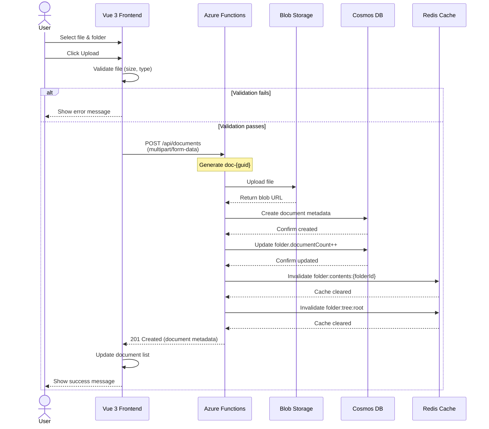
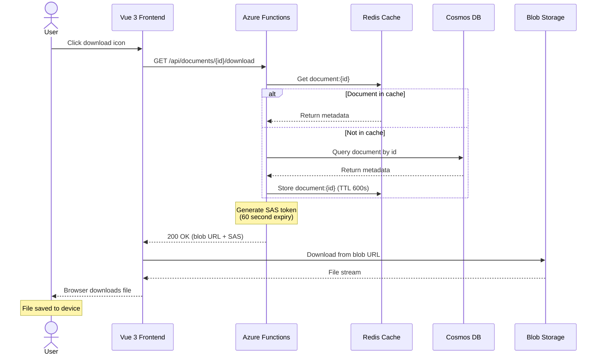
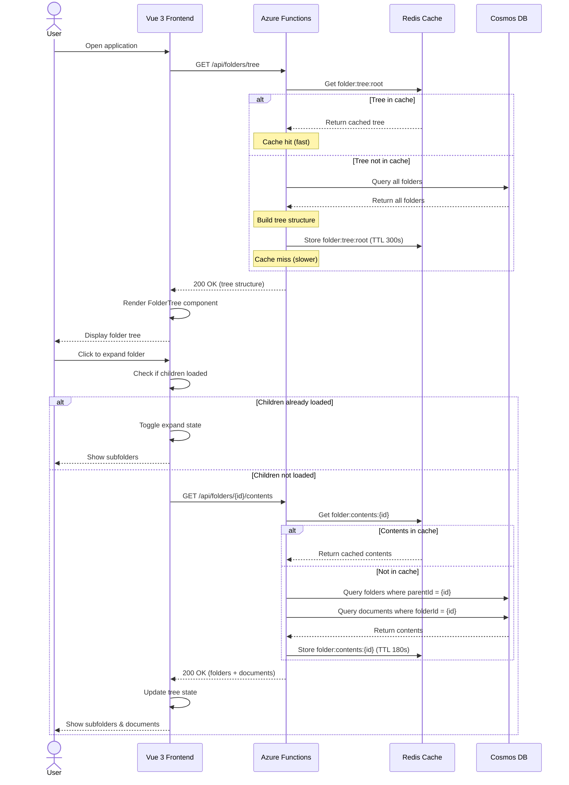
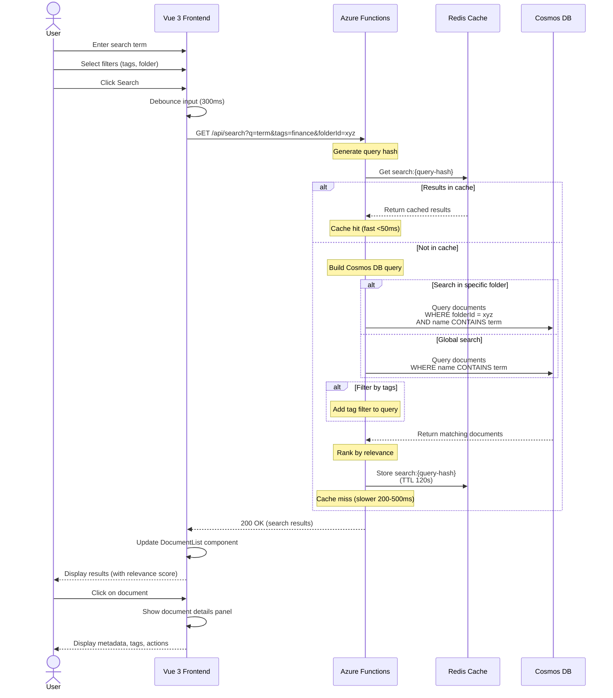
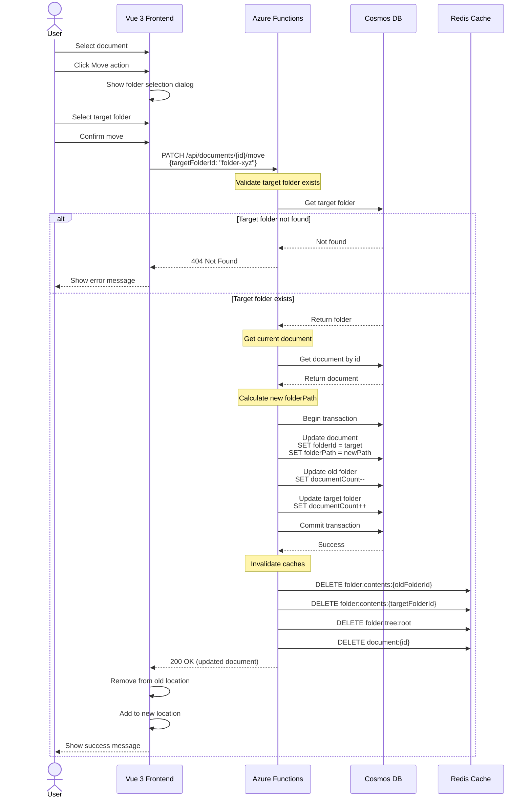
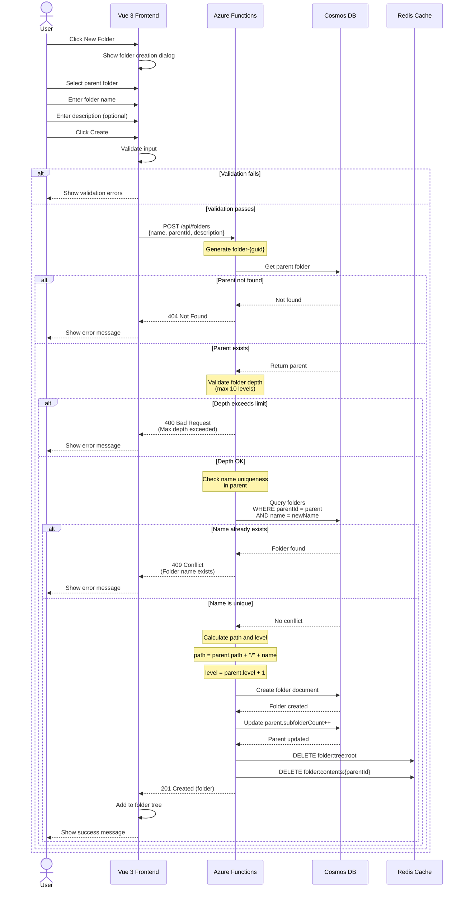
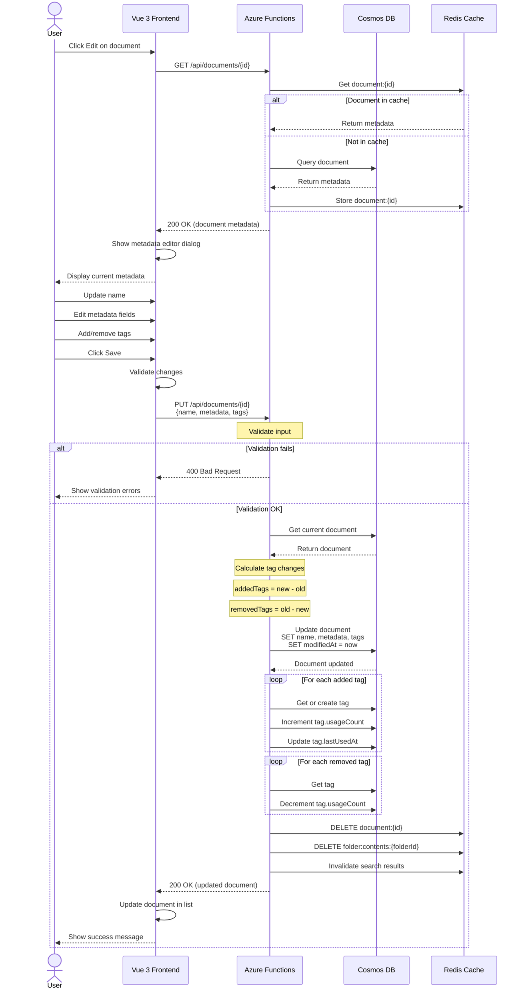

# Sequence Diagrams

**Purpose:** Shows time-based interactions for key workflows

**Last Updated:** 2025-09-30

**Version:** 1.0.0

## 1. Document Upload Workflow

## 2. Document Download Workflow

## 3. Folder Tree Navigation

## 4. Search Documents Workflow

## 5. Move Document Between Folders

## 6. Create Folder Workflow

## 7. Edit Document Metadata

## Key Observations

### Performance Optimizations
- Redis cache used for frequently accessed data (folder trees, search results)
- Cache-aside pattern with configurable TTL
- SAS tokens generated on-demand for secure blob access
- Debouncing on search input to reduce API calls

### Error Handling
- Validation at both frontend and backend
- Proper HTTP status codes (400, 404, 409, 500)
- User-friendly error messages
- Retry logic for transient failures (not shown)

### Consistency
- Transactional updates for multi-document changes
- Denormalized counts updated atomically
- Cache invalidation on data changes
- Optimistic concurrency using ETags (not shown)

### Security
- API authentication at gateway (not shown in diagrams)
- Time-limited SAS tokens for blob access
- Input validation on all endpoints
- HTTPS for all communications

## Notes

- All sequences assume successful authentication
- Monitoring and telemetry calls omitted for clarity
- Retry logic and circuit breakers not shown
- Frontend optimistic updates can be added for better UX
