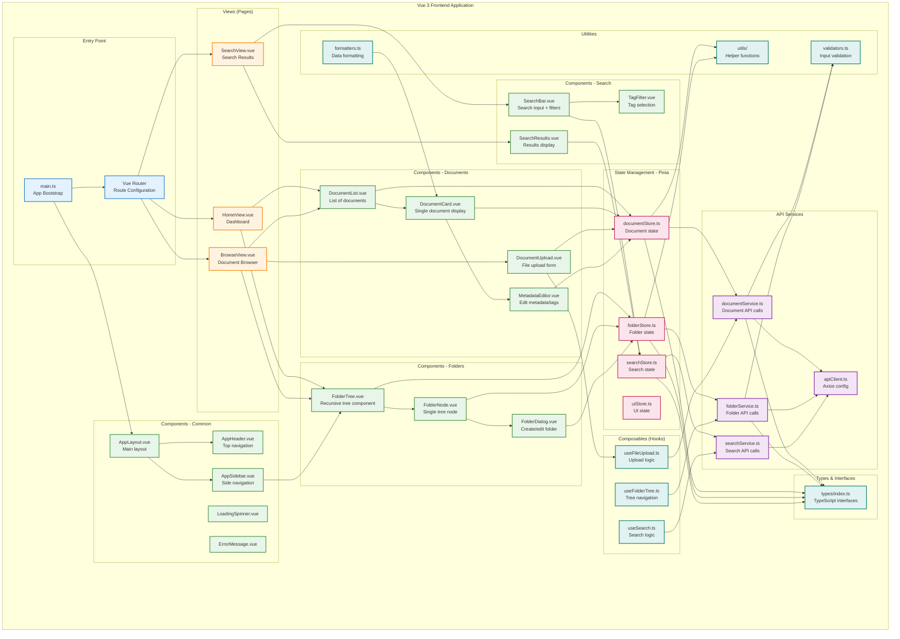
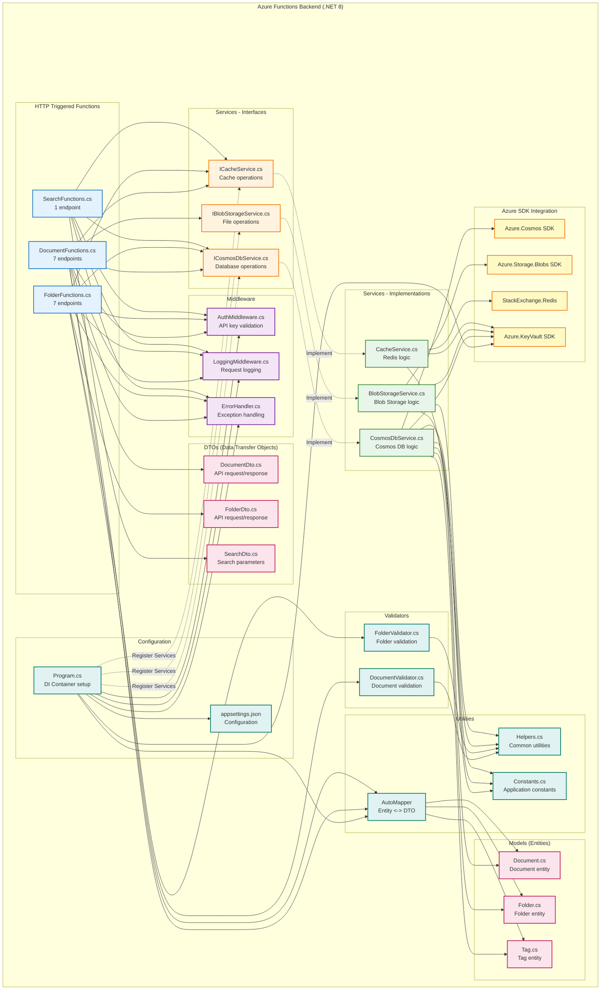

# Component Diagram

**Purpose:** Shows the module organization and dependencies for frontend and backend

**Last Updated:** 2025-09-30

**Version:** 1.0.0

## Frontend Component Architecture

## Backend Component Architecture

## Component Responsibilities

### Frontend Components

#### Entry Point
- **main.ts**: Bootstrap Vue 3 app, register plugins (Vuetify, Pinia, Router)
- **Vue Router**: Define routes and navigation guards

#### Views (Pages)
- **HomeView**: Dashboard with recent documents and quick actions
- **BrowseView**: Main document browser with folder tree and document list
- **SearchView**: Search interface with filters and results

#### Document Components
- **DocumentList**: Display paginated list of documents
- **DocumentCard**: Show individual document with metadata and actions
- **DocumentUpload**: Handle file selection, validation, and upload
- **MetadataEditor**: Form for editing document metadata and tags

#### Folder Components
- **FolderTree**: Recursive tree component for folder hierarchy
- **FolderNode**: Single tree node with expand/collapse and actions
- **FolderDialog**: Modal for creating or editing folders

#### Search Components
- **SearchBar**: Search input with autocomplete and filters
- **TagFilter**: Tag selection component with popular tags
- **SearchResults**: Display search results with relevance scores

#### Common Components
- **AppLayout**: Main application layout with header, sidebar, and content
- **AppHeader**: Top navigation with search and user menu
- **AppSidebar**: Side navigation with folder tree
- **LoadingSpinner**: Loading indicator
- **ErrorMessage**: Error display component

#### State Management (Pinia)
- **documentStore**: Manage document state, CRUD operations
- **folderStore**: Manage folder tree state and operations
- **searchStore**: Handle search queries and results
- **uiStore**: UI state (loading, errors, dialogs)

#### API Services
- **apiClient**: Axios instance with interceptors and error handling
- **documentService**: Document API calls (upload, download, CRUD)
- **folderService**: Folder API calls (tree, CRUD, move)
- **searchService**: Search API calls with query building

#### Composables
- **useFileUpload**: Reusable file upload logic with progress tracking
- **useFolderTree**: Tree navigation and state management
- **useSearch**: Search debouncing and filter management

#### Types & Utilities
- **types**: TypeScript interfaces for Document, Folder, Tag
- **validators**: Client-side input validation
- **formatters**: Date, file size, and text formatting
- **utils**: General helper functions

### Backend Components

#### HTTP Functions
- **DocumentFunctions**: 7 endpoints for document management
- **FolderFunctions**: 7 endpoints for folder management
- **SearchFunctions**: 1 endpoint for document search

#### Service Layer (Interfaces)
- **ICosmosDbService**: Database operations interface
- **IBlobStorageService**: File storage operations interface
- **ICacheService**: Cache operations interface

#### Service Layer (Implementations)
- **CosmosDbService**: Cosmos DB queries, transactions, and error handling
- **BlobStorageService**: Blob upload, download, SAS token generation
- **CacheService**: Redis get/set/delete with serialization

#### Models
- **Document**: Entity model with JSON attributes
- **Folder**: Entity model with validation
- **Tag**: Entity model with usage tracking

#### DTOs
- **DocumentDto**: API request/response objects
- **FolderDto**: API request/response objects
- **SearchDto**: Search parameters and results

#### Validators
- **DocumentValidator**: Validate document input (size, type, metadata)
- **FolderValidator**: Validate folder operations (depth, name uniqueness)

#### Middleware
- **AuthMiddleware**: Validate API keys from headers
- **LoggingMiddleware**: Log requests/responses to Application Insights
- **ErrorHandler**: Global exception handling and error responses

#### Utilities
- **AutoMapper**: Map between entities and DTOs
- **Helpers**: Common functions (GUID generation, path calculation)
- **Constants**: Application constants (max file size, depth limit)

#### Configuration
- **Program.cs**: Dependency injection container setup
- **appsettings.json**: Configuration for Azure services

#### Azure SDK Integration
- **Azure.Cosmos**: Cosmos DB client
- **Azure.Storage.Blobs**: Blob Storage client
- **StackExchange.Redis**: Redis client
- **Azure.KeyVault**: Key Vault for secrets

## Dependency Flow

### Frontend Dependency Flow
1. User interacts with **Component**
2. Component calls **Composable** (if complex logic)
3. Composable/Component dispatches action to **Pinia Store**
4. Store calls **Service** to make API request
5. Service uses **apiClient** to send HTTP request
6. Response validated against **Types**
7. Data formatted using **Formatters**
8. Store updates state
9. Component reactively updates UI

### Backend Dependency Flow
1. HTTP request hits **Azure Function**
2. **Middleware** (Auth, Logging) processes request
3. Function validates input using **Validator**
4. Function calls **Service Interface**
5. Service implementation uses **Azure SDK**
6. Data mapped between **Entity** and **DTO**
7. Response returned through **ErrorHandler**
8. Telemetry sent to Application Insights

## Design Patterns

### Frontend Patterns
- **Component Composition**: Reusable components with props and events
- **Composition API**: Logic reuse with composables
- **State Management**: Centralized state with Pinia stores
- **Service Layer**: Separation of API logic from components
- **Repository Pattern**: Services abstract API calls

### Backend Patterns
- **Dependency Injection**: Services injected via constructor
- **Repository Pattern**: Service layer abstracts data access
- **DTO Pattern**: Separate API contracts from domain models
- **Middleware Pipeline**: Request/response processing
- **Factory Pattern**: Client creation for Azure services
- **Singleton Pattern**: Shared Azure SDK clients

## Notes

- Frontend uses TypeScript for type safety
- Backend uses C# 12 with nullable reference types
- Async/await throughout for non-blocking operations
- Interface-based design for testability
- Clear separation of concerns (UI, state, services, data)
- All dependencies injected, not created in classes
