# Data Flow Diagram

**Purpose:** Shows how data moves through the system from upload to retrieval

**Last Updated:** 2025-09-30

**Version:** 1.0.0

## Document Upload Data Flow

```mermaid
graph LR
    subgraph "User Device"
        FILE[📄 Local File]
        BROWSER[🌐 Browser]
    end

    subgraph "Frontend Processing"
        SELECT[File Selection]
        VALIDATE[Client Validation<br/>- Size check<br/>- Type check]
        FORMDATA[Create FormData<br/>+ Metadata<br/>+ Tags<br/>+ Folder ID]
    end

    subgraph "API Gateway"
        AUTH[API Authentication<br/>Validate API Key]
        RATELIMIT[Rate Limiting<br/>Check quota]
    end

    subgraph "Azure Function"
        RECEIVE[Receive Upload<br/>Parse multipart]
        SERVERVAL[Server Validation<br/>- Size limit<br/>- Content type<br/>- Metadata format]
        GENID[Generate ID<br/>doc-{guid}]
    end

    subgraph "Blob Storage"
        BLOBWRITE[Write Binary Data<br/>Container: documents<br/>Name: doc-{guid}]
        BLOBMETA[Store Blob Metadata<br/>- Original filename<br/>- Content type<br/>- Upload date]
        GETURL[Get Blob URL]
    end

    subgraph "Cosmos DB"
        DOCWRITE[Create Document Record<br/>Container: documents<br/>Partition: folderId]
        FOLDERUPDATE[Update Folder<br/>documentCount++]
        TAGUPDATE[Update Tags<br/>usageCount++]
    end

    subgraph "Redis Cache"
        INVALIDATE[Invalidate Caches<br/>- folder:contents<br/>- folder:tree<br/>- search results]
    end

    subgraph "Response Path"
        BUILDRESP[Build Response<br/>Document metadata]
        RETURN[Return 201 Created]
        DISPLAY[Update UI<br/>Show new document]
    end

    FILE --> BROWSER
    BROWSER --> SELECT
    SELECT --> VALIDATE
    VALIDATE --> FORMDATA

    FORMDATA -->|HTTPS POST| AUTH
    AUTH --> RATELIMIT
    RATELIMIT --> RECEIVE

    RECEIVE --> SERVERVAL
    SERVERVAL --> GENID
    GENID --> BLOBWRITE

    BLOBWRITE --> BLOBMETA
    BLOBMETA --> GETURL
    GETURL --> DOCWRITE

    DOCWRITE --> FOLDERUPDATE
    FOLDERUPDATE --> TAGUPDATE
    TAGUPDATE --> INVALIDATE

    INVALIDATE --> BUILDRESP
    BUILDRESP --> RETURN
    RETURN -->|HTTPS Response| DISPLAY

    classDef userStyle fill:#e1f5ff,stroke:#01579b,stroke-width:2px
    classDef frontendStyle fill:#c8e6c9,stroke:#2e7d32,stroke-width:2px
    classDef apiStyle fill:#fff9c4,stroke:#f57f17,stroke-width:2px
    classDef functionStyle fill:#f8bbd0,stroke:#c2185b,stroke-width:2px
    classDef storageStyle fill:#d1c4e9,stroke:#512da8,stroke-width:2px
    classDef dbStyle fill:#b2dfdb,stroke:#00695c,stroke-width:2px
    classDef cacheStyle fill:#ffccbc,stroke:#d84315,stroke-width:2px
    classDef responseStyle fill:#f0f4c3,stroke:#827717,stroke-width:2px

    class FILE,BROWSER userStyle
    class SELECT,VALIDATE,FORMDATA frontendStyle
    class AUTH,RATELIMIT apiStyle
    class RECEIVE,SERVERVAL,GENID functionStyle
    class BLOBWRITE,BLOBMETA,GETURL storageStyle
    class DOCWRITE,FOLDERUPDATE,TAGUPDATE dbStyle
    class INVALIDATE cacheStyle
    class BUILDRESP,RETURN,DISPLAY responseStyle
```

## Document Download Data Flow

```mermaid
graph LR
    subgraph "User Action"
        CLICK[Click Download]
    end

    subgraph "Frontend"
        REQUEST[Send GET Request<br/>/api/documents/{id}/download]
    end

    subgraph "API Gateway"
        AUTH[API Authentication]
        ROUTE[Route to Function]
    end

    subgraph "Azure Function"
        GETMETA[Get Document Metadata]
    end

    subgraph "Cache Check"
        CHECKCACHE{Document<br/>in Cache?}
        READCACHE[Read from Redis<br/>Key: document:{id}]
    end

    subgraph "Cosmos DB Query"
        QUERYDB[Query Cosmos DB<br/>documents container]
        READDB[Read Document Record]
        WRITECACHE[Write to Cache<br/>TTL: 600s]
    end

    subgraph "Generate Access"
        GENSAS[Generate SAS Token<br/>60s expiry<br/>Read permission]
        BUILDURL[Build Blob URL<br/>with SAS token]
    end

    subgraph "Response"
        RETURNURL[Return URL<br/>to Frontend]
        INITDOWNLOAD[Initiate Download<br/>Direct to Blob]
    end

    subgraph "Blob Storage"
        READBLOB[Stream File Data]
        DOWNLOADFILE[Download to<br/>User Device]
    end

    CLICK --> REQUEST
    REQUEST --> AUTH
    AUTH --> ROUTE
    ROUTE --> GETMETA
    GETMETA --> CHECKCACHE

    CHECKCACHE -->|Yes - Cache Hit| READCACHE
    CHECKCACHE -->|No - Cache Miss| QUERYDB

    QUERYDB --> READDB
    READDB --> WRITECACHE
    READCACHE --> GENSAS
    WRITECACHE --> GENSAS

    GENSAS --> BUILDURL
    BUILDURL --> RETURNURL
    RETURNURL --> INITDOWNLOAD
    INITDOWNLOAD --> READBLOB
    READBLOB --> DOWNLOADFILE

    classDef userStyle fill:#e1f5ff,stroke:#01579b,stroke-width:2px
    classDef frontendStyle fill:#c8e6c9,stroke:#2e7d32,stroke-width:2px
    classDef apiStyle fill:#fff9c4,stroke:#f57f17,stroke-width:2px
    classDef functionStyle fill:#f8bbd0,stroke:#c2185b,stroke-width:2px
    classDef cacheStyle fill:#ffccbc,stroke:#d84315,stroke-width:2px
    classDef dbStyle fill:#b2dfdb,stroke:#00695c,stroke-width:2px
    classDef sasStyle fill:#e1bee7,stroke:#6a1b9a,stroke-width:2px
    classDef responseStyle fill:#f0f4c3,stroke:#827717,stroke-width:2px
    classDef storageStyle fill:#d1c4e9,stroke:#512da8,stroke-width:2px

    class CLICK userStyle
    class REQUEST frontendStyle
    class AUTH,ROUTE apiStyle
    class GETMETA functionStyle
    class CHECKCACHE,READCACHE,WRITECACHE cacheStyle
    class QUERYDB,READDB dbStyle
    class GENSAS,BUILDURL sasStyle
    class RETURNURL,INITDOWNLOAD responseStyle
    class READBLOB,DOWNLOADFILE storageStyle
```

## Search Data Flow

```mermaid
graph TB
    subgraph "User Input"
        TYPESEARCH[Type Search Query]
        SELECTFILTERS[Select Filters<br/>- Tags<br/>- Folder<br/>- Date range]
    end

    subgraph "Frontend Processing"
        DEBOUNCE[Debounce Input<br/>300ms delay]
        BUILDQUERY[Build Query String<br/>q=term&tags=x,y&folderId=z]
        SENDSEARCH[Send GET Request]
    end

    subgraph "API Gateway"
        AUTH[API Authentication]
        ROUTE[Route to<br/>Search Function]
    end

    subgraph "Azure Function"
        PARSEPARAMS[Parse Query Params]
        GENHASH[Generate Query Hash<br/>For cache key]
    end

    subgraph "Cache Layer"
        CHECKCACHE{Results<br/>in Cache?}
        READCACHE[Read from Redis<br/>search:{hash}]
        WRITECACHE[Write to Cache<br/>TTL: 120s]
    end

    subgraph "Cosmos DB"
        BUILDCOSMOSQ[Build Cosmos Query<br/>- Full-text search<br/>- Tag filters<br/>- Folder filters]
        EXECUTEQ[Execute Query<br/>with pagination]
        GETRESULTS[Get Results<br/>up to 100 docs]
    end

    subgraph "Processing"
        RANKRELEVANCE[Rank by Relevance<br/>- Exact match<br/>- Partial match<br/>- Tag matches]
        FORMATRESULTS[Format Results<br/>Add highlights]
    end

    subgraph "Response"
        RETURNRESULTS[Return Results<br/>+ Total count<br/>+ Page info]
        DISPLAYUI[Display in UI<br/>SearchResults component]
    end

    TYPESEARCH --> DEBOUNCE
    SELECTFILTERS --> BUILDQUERY
    DEBOUNCE --> BUILDQUERY
    BUILDQUERY --> SENDSEARCH

    SENDSEARCH --> AUTH
    AUTH --> ROUTE
    ROUTE --> PARSEPARAMS
    PARSEPARAMS --> GENHASH
    GENHASH --> CHECKCACHE

    CHECKCACHE -->|Yes - Fast| READCACHE
    CHECKCACHE -->|No - Slower| BUILDCOSMOSQ

    BUILDCOSMOSQ --> EXECUTEQ
    EXECUTEQ --> GETRESULTS
    GETRESULTS --> RANKRELEVANCE

    READCACHE --> FORMATRESULTS
    RANKRELEVANCE --> WRITECACHE
    WRITECACHE --> FORMATRESULTS

    FORMATRESULTS --> RETURNRESULTS
    RETURNRESULTS --> DISPLAYUI

    classDef inputStyle fill:#e1f5ff,stroke:#01579b,stroke-width:2px
    classDef frontendStyle fill:#c8e6c9,stroke:#2e7d32,stroke-width:2px
    classDef apiStyle fill:#fff9c4,stroke:#f57f17,stroke-width:2px
    classDef functionStyle fill:#f8bbd0,stroke:#c2185b,stroke-width:2px
    classDef cacheStyle fill:#ffccbc,stroke:#d84315,stroke-width:2px
    classDef dbStyle fill:#b2dfdb,stroke:#00695c,stroke-width:2px
    classDef processStyle fill:#e1bee7,stroke:#6a1b9a,stroke-width:2px
    classDef responseStyle fill:#f0f4c3,stroke:#827717,stroke-width:2px

    class TYPESEARCH,SELECTFILTERS inputStyle
    class DEBOUNCE,BUILDQUERY,SENDSEARCH frontendStyle
    class AUTH,ROUTE apiStyle
    class PARSEPARAMS,GENHASH functionStyle
    class CHECKCACHE,READCACHE,WRITECACHE cacheStyle
    class BUILDCOSMOSQ,EXECUTEQ,GETRESULTS dbStyle
    class RANKRELEVANCE,FORMATRESULTS processStyle
    class RETURNRESULTS,DISPLAYUI responseStyle
```

## Folder Tree Loading Data Flow

```mermaid
graph TB
    subgraph "Page Load"
        APPSTART[Application Starts]
        MOUNTTREE[Mount FolderTree<br/>Component]
    end

    subgraph "Frontend Request"
        REQUESTTREE[Request Folder Tree<br/>GET /api/folders/tree]
    end

    subgraph "API Gateway"
        AUTH[API Authentication]
    end

    subgraph "Azure Function"
        CHECKCACHE{Tree<br/>in Cache?}
    end

    subgraph "Cache Hit Path"
        READCACHE[Read from Redis<br/>folder:tree:root<br/>Fast: ~10ms]
        DESERIALIZE[Deserialize JSON]
        RETURNCACHED[Return Cached Tree]
    end

    subgraph "Cache Miss Path"
        QUERYFOLDER[Query All Folders<br/>FROM folders]
        READFOLDERS[Read All Records<br/>~100-1000 docs]
        BUILDTREE[Build Tree Structure<br/>Parent-child linking<br/>Sort by name]
        SERIALIZE[Serialize to JSON]
        STORECACHE[Store in Redis<br/>TTL: 300s]
        RETURNNEW[Return New Tree]
    end

    subgraph "Frontend Processing"
        RECEIVETREE[Receive Tree JSON]
        UPDATESTORE[Update folderStore]
        RENDERTREE[Render FolderTree<br/>Recursive component]
    end

    subgraph "User Interaction"
        EXPANDNODE[User Expands Node]
        CHECKLOADED{Children<br/>Loaded?}
        SHOWCHILDREN[Show Children]
        LOADCONTENTS[Load Folder Contents<br/>GET /api/folders/{id}/contents]
    end

    APPSTART --> MOUNTTREE
    MOUNTTREE --> REQUESTTREE
    REQUESTTREE --> AUTH
    AUTH --> CHECKCACHE

    CHECKCACHE -->|Yes - Cache Hit| READCACHE
    CHECKCACHE -->|No - Cache Miss| QUERYFOLDER

    READCACHE --> DESERIALIZE
    DESERIALIZE --> RETURNCACHED

    QUERYFOLDER --> READFOLDERS
    READFOLDERS --> BUILDTREE
    BUILDTREE --> SERIALIZE
    SERIALIZE --> STORECACHE
    STORECACHE --> RETURNNEW

    RETURNCACHED --> RECEIVETREE
    RETURNNEW --> RECEIVETREE

    RECEIVETREE --> UPDATESTORE
    UPDATESTORE --> RENDERTREE

    RENDERTREE --> EXPANDNODE
    EXPANDNODE --> CHECKLOADED
    CHECKLOADED -->|Yes| SHOWCHILDREN
    CHECKLOADED -->|No| LOADCONTENTS

    classDef startStyle fill:#e1f5ff,stroke:#01579b,stroke-width:2px
    classDef frontendStyle fill:#c8e6c9,stroke:#2e7d32,stroke-width:2px
    classDef apiStyle fill:#fff9c4,stroke:#f57f17,stroke-width:2px
    classDef cacheHitStyle fill:#a5d6a7,stroke:#2e7d32,stroke-width:3px
    classDef cacheMissStyle fill:#ef9a9a,stroke:#c62828,stroke-width:2px
    classDef processStyle fill:#e1bee7,stroke:#6a1b9a,stroke-width:2px
    classDef interactionStyle fill:#f0f4c3,stroke:#827717,stroke-width:2px

    class APPSTART,MOUNTTREE startStyle
    class REQUESTTREE,RECEIVETREE,UPDATESTORE,RENDERTREE frontendStyle
    class AUTH apiStyle
    class CHECKCACHE,READCACHE,DESERIALIZE,RETURNCACHED cacheHitStyle
    class QUERYFOLDER,READFOLDERS,BUILDTREE,SERIALIZE,STORECACHE,RETURNNEW cacheMissStyle
    class EXPANDNODE,CHECKLOADED,SHOWCHILDREN,LOADCONTENTS interactionStyle
```

## Data Transformation Flow

```mermaid
graph LR
    subgraph "Raw File"
        BINARY[📄 Binary File Data<br/>JPG, PDF, DOCX, etc.]
    end

    subgraph "Frontend Transformation"
        FILEOBJ[JavaScript File Object<br/>+ name<br/>+ size<br/>+ type]
        FORMDATA[FormData Object<br/>+ file<br/>+ folderId<br/>+ metadata<br/>+ tags]
    end

    subgraph "API Gateway Transformation"
        MULTIPART[Multipart/Form-Data<br/>HTTP format]
    end

    subgraph "Azure Function Transformation"
        PARSEMULTI[Parse Multipart<br/>Extract parts]
        STREAM[File Stream<br/>+ Metadata JSON]
    end

    subgraph "Blob Storage Transformation"
        BLOBDATA[Blob Binary<br/>+ Blob Metadata<br/>Properties]
    end

    subgraph "Cosmos DB Transformation"
        ENTITY[C# Document Entity<br/>Strongly-typed object]
        JSON[Cosmos DB JSON<br/>NoSQL document]
    end

    subgraph "Redis Cache Transformation"
        SERIALIZED[Serialized JSON String<br/>Compressed]
    end

    subgraph "API Response Transformation"
        DTO[DocumentDto C# Object<br/>API contract]
        RESPJSON[Response JSON<br/>Camel-cased]
    end

    subgraph "Frontend State Transformation"
        JSOBJ[JavaScript Object<br/>TypeScript interface]
        REACTIVE[Vue Reactive State<br/>Pinia store]
    end

    BINARY --> FILEOBJ
    FILEOBJ --> FORMDATA
    FORMDATA --> MULTIPART
    MULTIPART --> PARSEMULTI
    PARSEMULTI --> STREAM
    STREAM --> BLOBDATA
    STREAM --> ENTITY
    ENTITY --> JSON
    JSON --> SERIALIZED
    ENTITY --> DTO
    DTO --> RESPJSON
    RESPJSON --> JSOBJ
    JSOBJ --> REACTIVE

    classDef rawStyle fill:#e1f5ff,stroke:#01579b,stroke-width:2px
    classDef frontendTransform fill:#c8e6c9,stroke:#2e7d32,stroke-width:2px
    classDef apiTransform fill:#fff9c4,stroke:#f57f17,stroke-width:2px
    classDef backendTransform fill:#f8bbd0,stroke:#c2185b,stroke-width:2px
    classDef storageTransform fill:#d1c4e9,stroke:#512da8,stroke-width:2px
    classDef dbTransform fill:#b2dfdb,stroke:#00695c,stroke-width:2px
    classDef cacheTransform fill:#ffccbc,stroke:#d84315,stroke-width:2px
    classDef responseTransform fill:#e1bee7,stroke:#6a1b9a,stroke-width:2px
    classDef stateTransform fill:#f0f4c3,stroke:#827717,stroke-width:2px

    class BINARY rawStyle
    class FILEOBJ,FORMDATA frontendTransform
    class MULTIPART apiTransform
    class PARSEMULTI,STREAM,ENTITY,DTO backendTransform
    class BLOBDATA storageTransform
    class JSON dbTransform
    class SERIALIZED cacheTransform
    class RESPJSON responseTransform
    class JSOBJ,REACTIVE stateTransform
```



## Key Data Flow Observations

### Performance Optimization
- **Cache First**: Always check Redis before querying Cosmos DB
- **Debouncing**: Search input debounced to reduce API calls
- **Direct Downloads**: Files streamed directly from Blob Storage (not through API)
- **SAS Tokens**: Time-limited access to blobs without API authentication
- **Tree Caching**: Entire folder tree cached for 5 minutes

### Data Consistency
- **Invalidation Strategy**: Caches invalidated on data changes
- **Denormalized Counts**: Folder counts updated atomically with document changes
- **Transaction Support**: Related updates wrapped in transactions
- **ETag Concurrency**: Optimistic concurrency for Cosmos DB

### Security Considerations
- **API Authentication**: All API calls require API key
- **SAS Tokens**: Short-lived (60s) tokens for blob access
- **HTTPS Only**: All data transfer encrypted in transit
- **Input Validation**: Both client and server-side validation
- **Private Blobs**: No anonymous access to blob storage

### Scalability Factors
- **Partitioning**: Documents partitioned by folderId for parallel processing
- **Pagination**: Search and list operations support pagination
- **Streaming**: Large files streamed (not loaded into memory)
- **Serverless**: Azure Functions auto-scale based on load
- **CDN**: Static assets served from CDN

### Data Size Considerations
- **Max File Size**: 5GB per document
- **Max Metadata**: 20 key-value pairs per document
- **Max Tags**: 50 tags per document
- **Max Folder Depth**: 10 levels
- **Cache TTL**: 120s (search) to 600s (documents)

## Notes

- All timestamps in ISO 8601 format (UTC)
- File content never passes through Azure Functions (direct to Blob Storage)
- Folder tree optimized with single query + in-memory tree building
- Search results limited to 100 documents per page
- Cache keys use consistent naming pattern for easy debugging
