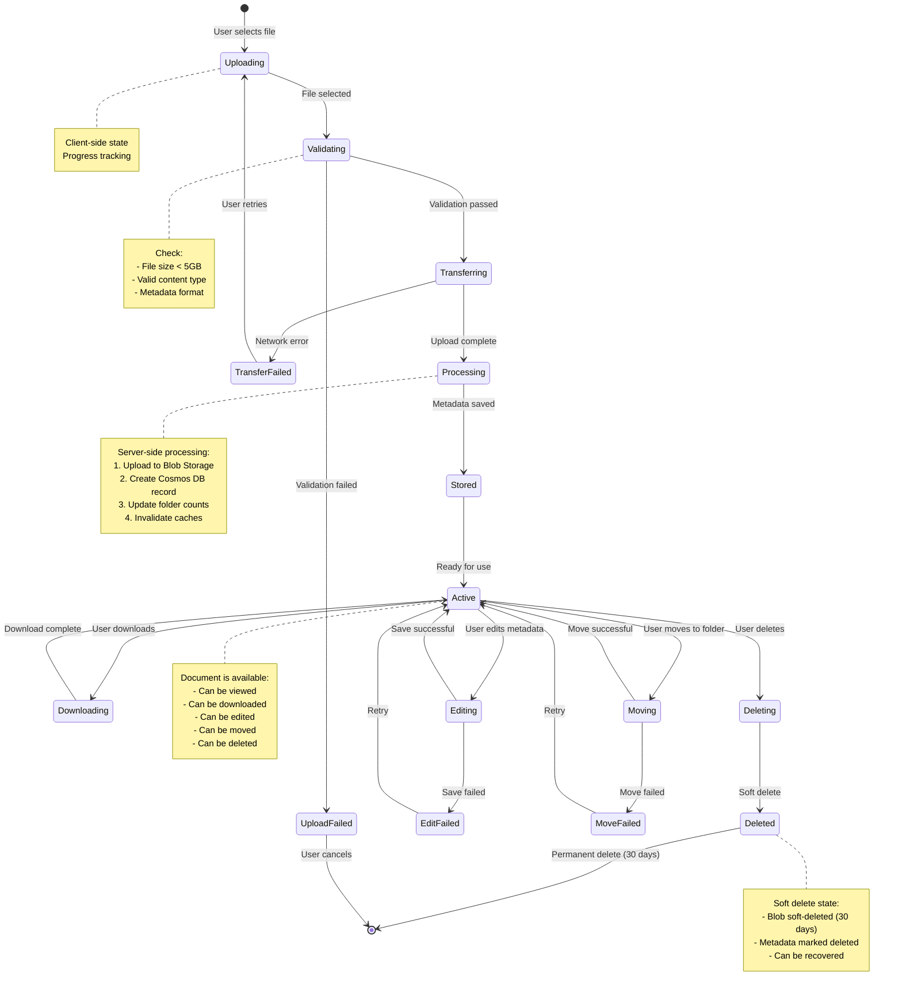
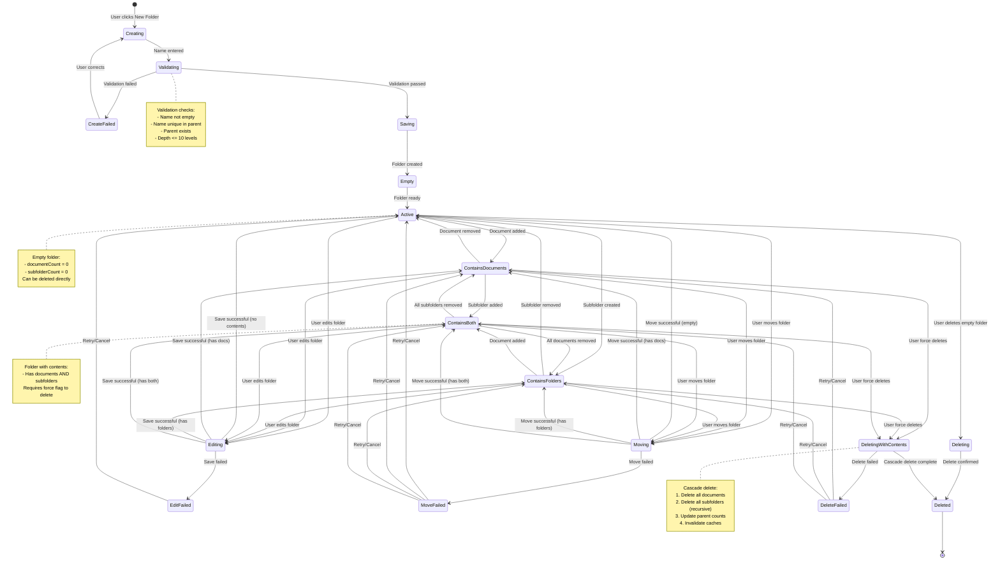
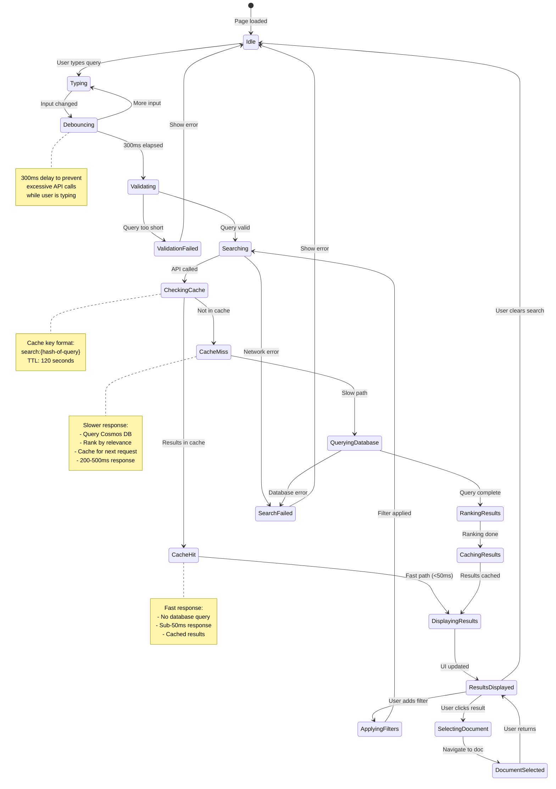
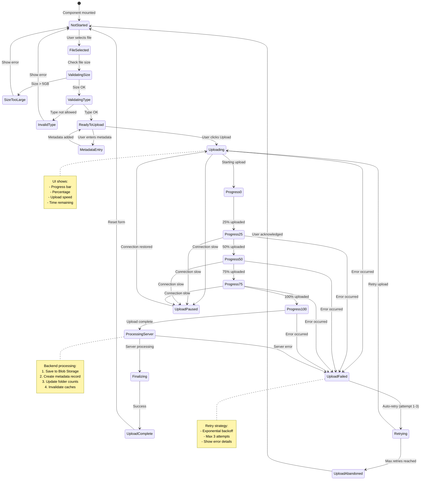
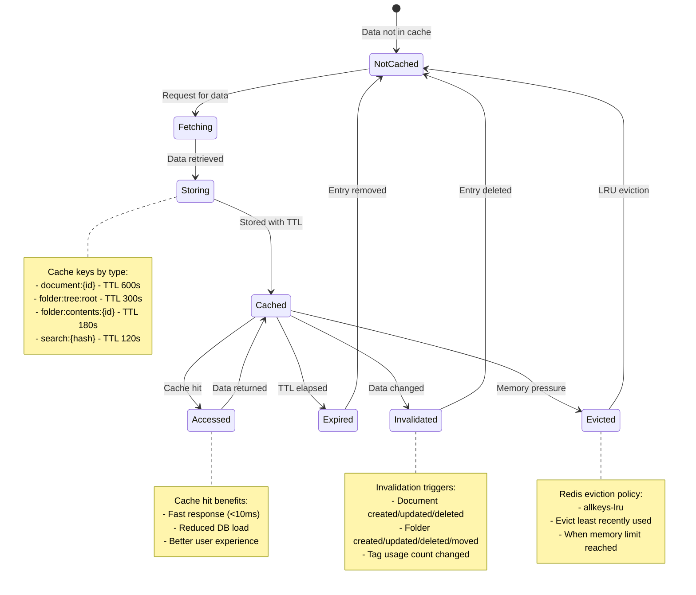
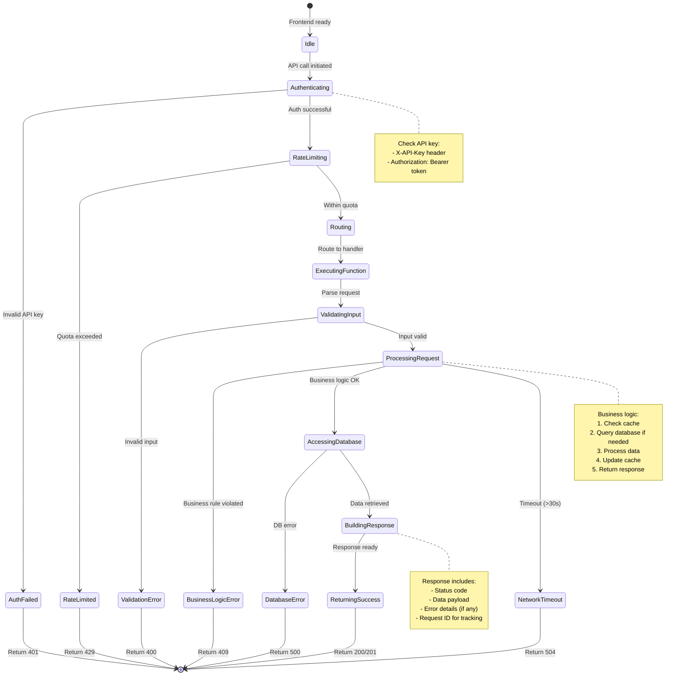

# State Diagrams

**Purpose:** Shows object lifecycle and state transitions

**Last Updated:** 2025-09-30

**Version:** 1.0.0

## Document Lifecycle State Diagram

## Folder State Diagram

## Search Request State Diagram

## File Upload Progress State Diagram

## Cache Entry State Diagram

## API Request State Diagram

## Key State Management Observations

### Document Lifecycle
- Documents go through validation before upload
- Active state is the primary operational state
- Soft delete with 30-day recovery period
- Failed operations allow retry without data loss

### Folder Management
- Folders track content state (empty, has docs, has folders, has both)
- Cascade delete requires force flag for safety
- Moving folders updates all descendant paths
- Empty folders can be deleted immediately

### Search Request Flow
- Debouncing prevents excessive API calls
- Cache-first strategy for performance
- Results ranked by relevance before display
- Filters trigger new search requests

### Upload Progress
- Multi-stage validation before upload
- Progress tracking at 25% intervals
- Automatic retry with exponential backoff
- Server processing after upload complete

### Cache Management
- Time-based expiration (TTL)
- Explicit invalidation on data changes
- LRU eviction under memory pressure
- Different TTLs based on data volatility

### API Request Processing
- Multi-stage security checks (auth, rate limiting)
- Input validation before processing
- Comprehensive error handling with appropriate status codes
- Timeout protection (30s maximum)

## Notes

- All state transitions logged for debugging
- Failed states include retry mechanisms where appropriate
- User-facing states provide clear feedback
- Backend states optimize for performance and consistency
- Cache states balance freshness vs. performance
