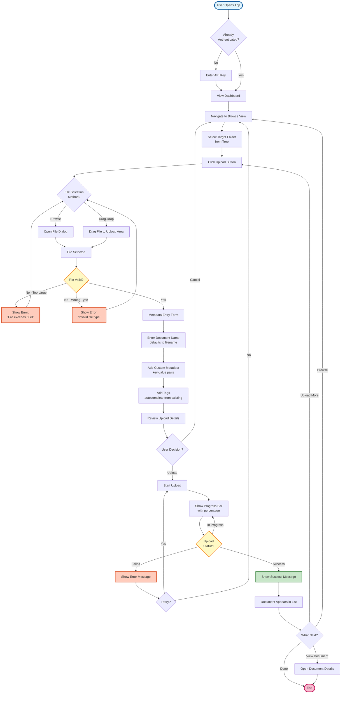
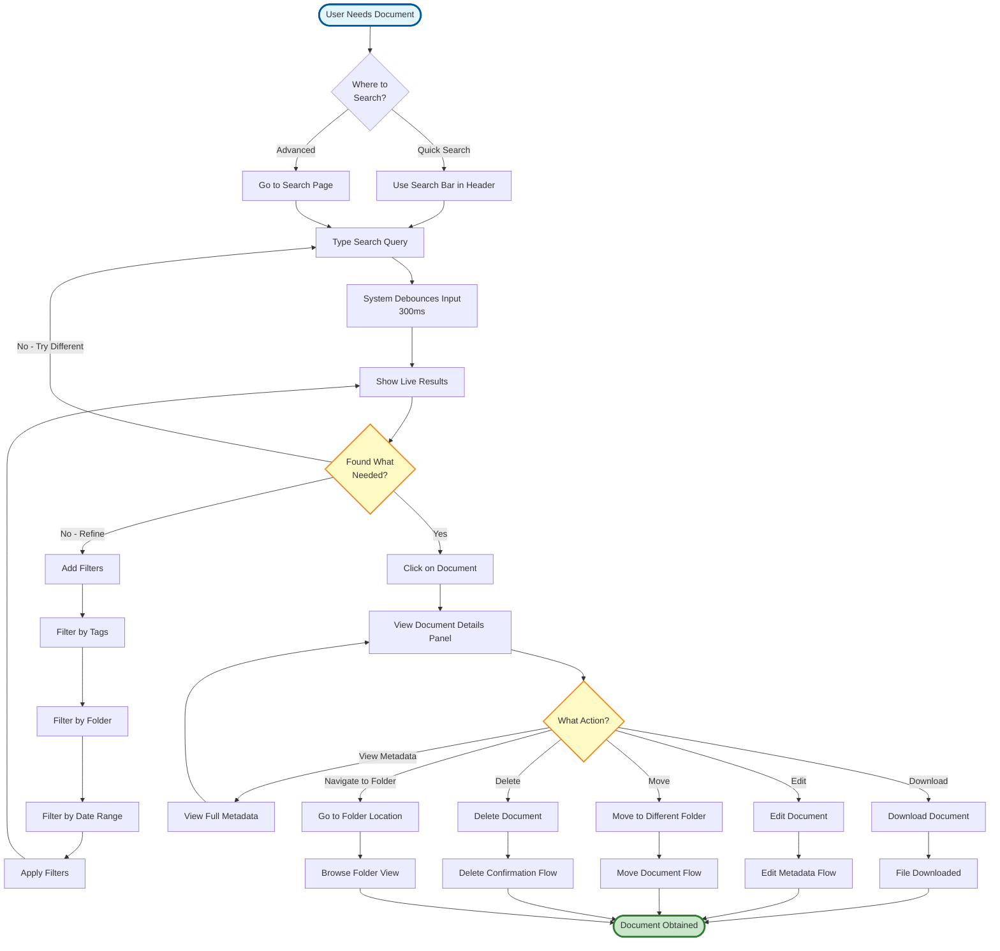
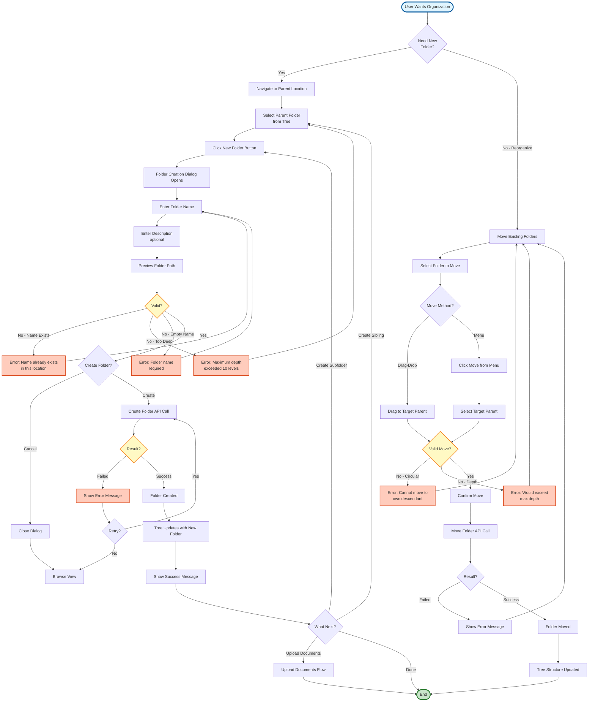
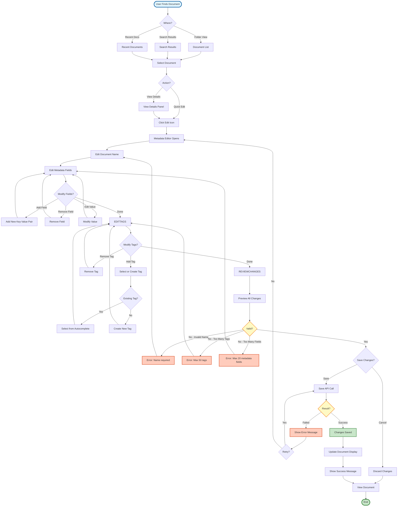
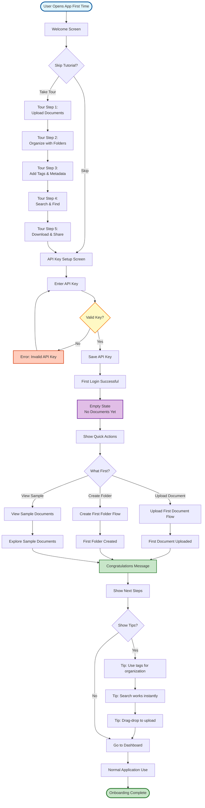

# User Flow Diagrams

**Purpose:** Shows user journey through the application for key tasks

**Last Updated:** 2025-09-30

**Version:** 1.0.0

## Upload Document User Flow

## Search and Find Document User Flow

## Create Folder Structure User Flow

## Edit Document Metadata User Flow

## Mobile Document Access User Flow

```mermaid
graph TD
    START([User Opens App on Mobile]) --> RESPONSIVE[Mobile-Responsive UI Loads]

    RESPONSIVE --> MOBILENAV{Navigation<br/>Method?}

    MOBILENAV -->|Menu| OPENMENU[Tap Hamburger Menu]
    MOBILENAV -->|Search| MOBILESEARCH[Use Search Bar]
    MOBILENAV -->|Recent| VIEWRECENT[View Recent Documents]

    OPENMENU --> SIDEMENU[Side Menu Opens]
    SIDEMENU --> FOLDERTREE[Folder Tree<br/>Touch-Optimized]
    FOLDERTREE --> TAPFOLDER[Tap to Expand Folder]
    TAPFOLDER --> EXPANDFOLDER[Folder Expands]
    EXPANDFOLDER --> TAPAGAIN{Tap Again?}
    TAPAGAIN -->|Expand Child| TAPFOLDER
    TAPAGAIN -->|Select Folder| SELECTFOLDER[Open Folder]

    SELECTFOLDER --> DOCLIST[Document List<br/>Card View]
    VIEWRECENT --> DOCLIST

    MOBILESEARCH --> TYPEMOBILE[Type Search Query<br/>Mobile Keyboard]
    TYPEMOBILE --> SEARCHRESULTS[View Results]
    SEARCHRESULTS --> DOCLIST

    DOCLIST --> SWIPE{Swipe<br/>Action?}
    SWIPE -->|Swipe Left| QUICKACTIONS[Quick Actions Menu<br/>Download/Share/Delete]
    SWIPE -->|Swipe Right| SHOWMORE[Show More Info]
    SWIPE -->|Tap| TAPDOC[Tap Document]

    TAPDOC --> DOCDETAILS[Document Details<br/>Bottom Sheet]
    QUICKACTIONS --> DOCDETAILS

    DOCDETAILS --> DETAILACTIONS{What Action?}

    DETAILACTIONS -->|Download| CHECKSIZE{File Size?}
    CHECKSIZE -->|Large >10MB| WARNSIZE[Warning: Large File<br/>Use WiFi]
    WARNSIZE --> CONFIRMDOWNLOAD{Proceed?}
    CONFIRMDOWNLOAD -->|No| DOCDETAILS
    CONFIRMDOWNLOAD -->|Yes| DOWNLOAD
    CHECKSIZE -->|Small| DOWNLOAD[Download File]

    DOWNLOAD --> DOWNLOADPROGRESS[Show Progress]
    DOWNLOADPROGRESS --> DOWNLOADED[File Downloaded]
    DOWNLOADED --> OPENFILE[Open in Mobile Viewer]
    OPENFILE --> FILEVIEWER[PDF/Image/Document Viewer]
    FILEVIEWER --> END([End])

    DETAILACTIONS -->|Share| SHAREMENU[Native Share Menu]
    SHAREMENU --> SHARELINK[Share Document Link]
    SHARELINK --> END

    DETAILACTIONS -->|View Details| FULLDETAILS[Full Metadata View<br/>Scrollable]
    FULLDETAILS --> DOCDETAILS

    DETAILACTIONS -->|Upload| MOBILEUPLOAD[Mobile Upload Flow]
    MOBILEUPLOAD --> CHOOSESOURCE{File Source?}
    CHOOSESOURCE -->|Camera| OPENCAMERA[Open Camera]
    CHOOSESOURCE -->|Gallery| OPENGALLERY[Open Photo Gallery]
    CHOOSESOURCE -->|Files| OPENFILES[Open File Picker]

    OPENCAMERA --> TAKEPHOTO[Take Photo]
    TAKEPHOTO --> PHOTOCAPTURED[Photo Captured]
    PHOTOCAPTURED --> UPLOADPREVIEW[Preview Upload]

    OPENGALLERY --> SELECTPHOTO[Select Photo]
    SELECTPHOTO --> UPLOADPREVIEW

    OPENFILES --> SELECTFILE[Select File]
    SELECTFILE --> UPLOADPREVIEW

    UPLOADPREVIEW --> ADDMOBILEMETA[Add Metadata<br/>Touch-Friendly Form]
    ADDMOBILEMETA --> UPLOADFILE[Upload File]
    UPLOADFILE --> UPLOADING[Show Upload Progress]
    UPLOADING --> UPLOADCOMPLETE[Upload Complete]
    UPLOADCOMPLETE --> END

    style START fill:#e1f5ff,stroke:#01579b,stroke-width:3px
    style END fill:#c8e6c9,stroke:#2e7d32,stroke-width:3px
    style CHECKSIZE fill:#fff9c4,stroke:#f57f17,stroke-width:2px
    style WARNSIZE fill:#fff3e0,stroke:#f57c00,stroke-width:2px
    style RESPONSIVE fill:#f3e5f5,stroke:#7b1fa2,stroke-width:2px
    style DOCLIST fill:#f3e5f5,stroke:#7b1fa2,stroke-width:2px
```

## First-Time User Onboarding Flow

## User Flow Observations

### Upload Flow Key Points
- Multiple file selection methods (browse, drag-drop)
- Progressive disclosure (metadata optional, can be added later)
- Clear validation with helpful error messages
- Progress indication for large files
- Automatic retry on failure

### Search Flow Key Points
- Multiple entry points (header bar, search page)
- Live results as user types (debounced)
- Progressive filtering to refine results
- Quick actions from search results
- Path back to folder location

### Folder Management Key Points
- Visual folder tree for context
- Preview of full path before creation
- Validation prevents common errors
- Drag-drop for easy reorganization
- Confirmation on destructive actions

### Edit Metadata Flow Key Points
- Multiple entry points to editor
- Autocomplete for tags (reuse existing)
- Preview changes before saving
- Clear error messages with guidance
- Discard option to cancel changes

### Mobile Flow Key Points
- Touch-optimized UI components
- Swipe gestures for quick actions
- File size warnings on cellular
- Native share integration
- Camera upload for photos

### Onboarding Flow Key Points
- Optional tutorial (can skip)
- Interactive guided tour
- API key setup with validation
- Empty state with clear actions
- Helpful tips for new users

## Notes

- All flows include error handling and recovery
- User can cancel most operations
- Progress indication for long operations
- Confirmation required for destructive actions
- Mobile flows optimized for touch interaction
- Accessibility considered in all flows
