# Deployment Diagram

**Purpose:** Shows the Azure infrastructure layout and deployment topology

**Last Updated:** 2025-09-30

**Version:** 1.0.0

## Azure Cloud Deployment Architecture

```mermaid
graph TB
    subgraph "Internet"
        USERS[👥 Users<br/>Desktop & Mobile]
    end

    subgraph "Azure Region: East US"
        subgraph "Resource Group: docmgr-rg-prod"

            subgraph "Frontend Tier"
                STATICAPP[Azure Static Web Apps<br/>docmgr-webapp-prod<br/>SKU: Standard<br/>Global CDN Enabled]
            end

            subgraph "API Tier"
                APIM[Azure API Management<br/>docmgr-apim-prod<br/>SKU: Developer/Standard<br/>API Gateway]

                FUNCPLAN[App Service Plan<br/>docmgr-plan-prod<br/>SKU: Premium EP1<br/>Elastic Premium]

                FUNCAPP[Azure Functions<br/>docmgr-func-prod<br/>Runtime: .NET 8<br/>15 HTTP Functions]
            end

            subgraph "Data Tier"
                COSMOS[Cosmos DB Account<br/>docmgr-cosmos-prod<br/>API: NoSQL<br/>Consistency: Session<br/>Auto-scale RU/s]

                COSMOSDB[(Database: DocumentManager<br/>• documents container<br/>• folders container<br/>• tags container)]

                STORAGE[Storage Account<br/>docmgrstorageprod<br/>SKU: Standard LRS<br/>Replication: Local]

                BLOBCONTAINER[Blob Container: documents<br/>Access: Private<br/>Versioning: Enabled<br/>Soft Delete: 30 days]

                REDIS[Azure Cache for Redis<br/>docmgr-redis-prod<br/>SKU: Basic C1<br/>1GB Memory]
            end

            subgraph "Security & Monitoring"
                KEYVAULT[Key Vault<br/>docmgr-kv-prod<br/>• Connection strings<br/>• API keys<br/>• Secrets]

                APPINSIGHTS[Application Insights<br/>docmgr-ai-prod<br/>Workspace-based<br/>Retention: 90 days]

                LOGANALYTICS[Log Analytics Workspace<br/>docmgr-law-prod<br/>Centralized logs]
            end

        end
    end

    USERS -->|HTTPS| STATICAPP
    STATICAPP -->|HTTPS REST| APIM
    APIM --> FUNCAPP
    FUNCAPP --> FUNCPLAN

    FUNCAPP -->|Query/Write| COSMOS
    COSMOS --> COSMOSDB
    FUNCAPP -->|Upload/Download| STORAGE
    STORAGE --> BLOBCONTAINER
    FUNCAPP -->|Cache| REDIS

    FUNCAPP -.->|Get Secrets| KEYVAULT
    STATICAPP -.->|Get Secrets| KEYVAULT

    FUNCAPP -.->|Telemetry| APPINSIGHTS
    STATICAPP -.->|Telemetry| APPINSIGHTS
    APPINSIGHTS --> LOGANALYTICS
    COSMOS -.->|Logs| LOGANALYTICS
    STORAGE -.->|Logs| LOGANALYTICS
    REDIS -.->|Logs| LOGANALYTICS

    classDef userStyle fill:#e1f5ff,stroke:#01579b,stroke-width:3px
    classDef frontendStyle fill:#c8e6c9,stroke:#2e7d32,stroke-width:2px
    classDef apiStyle fill:#fff9c4,stroke:#f57f17,stroke-width:2px
    classDef computeStyle fill:#f8bbd0,stroke:#c2185b,stroke-width:2px
    classDef dataStyle fill:#d1c4e9,stroke:#512da8,stroke-width:2px
    classDef securityStyle fill:#ffccbc,stroke:#d84315,stroke-width:2px

    class USERS userStyle
    class STATICAPP frontendStyle
    class APIM apiStyle
    class FUNCPLAN,FUNCAPP computeStyle
    class COSMOS,COSMOSDB,STORAGE,BLOBCONTAINER,REDIS dataStyle
    class KEYVAULT,APPINSIGHTS,LOGANALYTICS securityStyle
```



## Deployment Topology - All Environments


## Network Architecture (Production)

```
┌────────────────────────────────────────────────────────────────┐
│                         Internet                                │
│                      (Public Network)                          │
└────────────────────┬───────────────────────────────────────────┘
                     │
                     │ HTTPS (443)
                     │
┌────────────────────▼───────────────────────────────────────────┐
│                   Azure Front Door                             │
│              (Global Load Balancer)                            │
│              WAF Enabled (optional)                            │
└────────────────────┬───────────────────────────────────────────┘
                     │
        ┌────────────┼────────────┐
        │                         │
        ▼                         ▼
┌───────────────┐         ┌──────────────────┐
│  Static Web   │         │  API Management  │
│     Apps      │         │   Gateway        │
│   (Frontend)  │         │                  │
│               │         │  • Rate Limiting │
│ CDN Enabled   │         │  • API Key Auth  │
│ Global Edge   │         │  • Policies      │
└───────────────┘         └────────┬─────────┘
                                   │
                                   │ Private Endpoint (optional)
                                   │
                          ┌────────▼─────────┐
                          │  Azure Functions │
                          │  (Backend API)   │
                          │                  │
                          │  VNet Integration│
                          └────────┬─────────┘
                                   │
              ┌────────────────────┼────────────────────┐
              │                    │                    │
              ▼                    ▼                    ▼
      ┌──────────────┐    ┌──────────────┐    ┌──────────────┐
      │  Cosmos DB   │    │Blob Storage  │    │    Redis     │
      │              │    │              │    │    Cache     │
      │ Private      │    │ Private      │    │              │
      │ Endpoint     │    │ Endpoint     │    │ Private      │
      │              │    │              │    │ Endpoint     │
      └──────────────┘    └──────────────┘    └──────────────┘
              │                    │                    │
              └────────────────────┼────────────────────┘
                                   │
                          ┌────────▼─────────┐
                          │  Log Analytics   │
                          │    Workspace     │
                          │                  │
                          │ Centralized Logs │
                          └──────────────────┘

Network Security:
• All traffic encrypted (TLS 1.2+)
• Private Endpoints for data services (production)
• Network Security Groups (NSG) on subnets
• Service Endpoints for Azure services
• No public access to databases
```

## CI/CD Pipeline Architecture


## Azure Resource Specifications

### Frontend - Azure Static Web Apps

**Development**:
- SKU: Free
- Custom domain: No
- CDN: No
- Auto-deploy: On push to `develop`

**Staging**:
- SKU: Standard
- Custom domain: staging.docmanager.com
- CDN: Enabled
- Auto-deploy: On push to `main`

**Production**:
- SKU: Standard
- Custom domain: app.docmanager.com
- CDN: Enabled with Azure Front Door
- Auto-deploy: Manual approval required
- SSL: Custom certificate from Key Vault

### Backend - Azure Functions

**Development**:
- Plan: Consumption (Serverless)
- Runtime: .NET 8
- Region: East US
- Auto-scale: Automatic
- Cost: Pay per execution

**Staging**:
- Plan: Premium EP1 (Elastic Premium)
- vCPU: 1
- Memory: 3.5 GB
- Pre-warmed instances: 1
- Max scale-out: 10

**Production**:
- Plan: Premium EP1 (Elastic Premium)
- vCPU: 1
- Memory: 3.5 GB
- Pre-warmed instances: 2
- Max scale-out: 20
- VNet Integration: Enabled

### Data - Cosmos DB

**Development**:
- Capacity mode: Serverless
- Consistency: Session
- Multi-region: No
- Backup: Periodic (24h)

**Staging**:
- Capacity mode: Provisioned throughput
- RU/s: 400 (manual)
- Consistency: Session
- Multi-region: No
- Backup: Periodic (12h)

**Production**:
- Capacity mode: Autoscale
- RU/s: 400-4000 (autoscale)
- Consistency: Session
- Multi-region: Read replicas (optional)
- Backup: Continuous (7 days)
- Availability Zones: Enabled

### Data - Blob Storage

**All Environments**:
- Performance: Standard
- Replication: LRS (Locally Redundant Storage)
- Access tier: Hot
- Versioning: Enabled
- Soft delete: 30 days
- Lifecycle management: Move to Cool after 90 days (production only)

**Production Additional**:
- Private endpoint enabled
- Network rules: Deny public access
- Diagnostic logs: Enabled

### Cache - Azure Redis

**Development**:
- SKU: Basic C0
- Memory: 250 MB
- Clustering: No

**Staging**:
- SKU: Basic C1
- Memory: 1 GB
- Clustering: No

**Production**:
- SKU: Standard C1
- Memory: 1 GB
- Clustering: No
- Redis data persistence: Enabled
- Private endpoint: Enabled

### Security - Key Vault

**All Environments**:
- SKU: Standard
- Soft delete: Enabled (90 days)
- Purge protection: Enabled (production only)
- Access policy: Azure RBAC
- Network rules: Allow Azure services (dev/staging), Private endpoint (production)

### Monitoring - Application Insights

**All Environments**:
- Type: Workspace-based
- Sampling: Adaptive (production: 20%, dev/staging: 100%)
- Retention: 90 days
- Daily cap: 1 GB (dev), 5 GB (staging), 10 GB (production)

## Cost Estimation (Monthly)

### Development Environment
- Static Web Apps: Free
- Functions (Consumption): ~$20
- Cosmos DB (Serverless): ~$25
- Blob Storage: ~$5
- Redis (Basic C0): ~$17
- Key Vault: ~$3
- Application Insights: ~$10
- **Total: ~$80/month**

### Staging Environment
- Static Web Apps: ~$10
- Functions (Premium EP1): ~$150
- Cosmos DB (Provisioned 400 RU/s): ~$24
- Blob Storage: ~$10
- Redis (Basic C1): ~$28
- Key Vault: ~$3
- Application Insights: ~$20
- **Total: ~$245/month**

### Production Environment
- Static Web Apps: ~$10
- Functions (Premium EP1): ~$150
- Cosmos DB (Autoscale 400-4000): ~$24-240
- Blob Storage: ~$50
- Redis (Standard C1): ~$75
- Key Vault: ~$3
- Application Insights: ~$50
- API Management (optional): ~$50-500
- **Total: ~$412-1078/month** (depending on usage)

## Deployment Checklist

### Pre-Deployment
- [ ] Provision all Azure resources using Bicep
- [ ] Configure Key Vault with secrets
- [ ] Set up managed identities
- [ ] Configure network security rules
- [ ] Set up Application Insights
- [ ] Configure CI/CD pipelines
- [ ] Set up alerts and monitoring

### Deployment Steps
1. Deploy infrastructure (Bicep)
2. Deploy backend (Azure Functions)
3. Run database migrations (if needed)
4. Deploy frontend (Static Web Apps)
5. Run smoke tests
6. Verify health checks
7. Update DNS (if needed)
8. Monitor for 24-48 hours

### Post-Deployment
- [ ] Verify all endpoints responding
- [ ] Check Application Insights for errors
- [ ] Test upload/download functionality
- [ ] Verify caching working
- [ ] Monitor performance metrics
- [ ] Update documentation
- [ ] Notify stakeholders

## Notes

- All resources use consistent naming convention: `{project}-{resource}-{environment}-{region}`
- Managed identities used for authentication between Azure services
- Private endpoints recommended for production data services
- Auto-scaling configured for Functions and Cosmos DB in production
- Monitoring and alerting configured for all critical resources
- Blue-green deployment strategy for zero-downtime deployments (advanced)
- Disaster recovery: Geo-redundant backups for production (optional)
