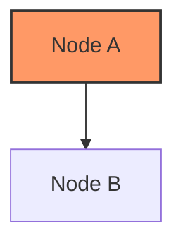
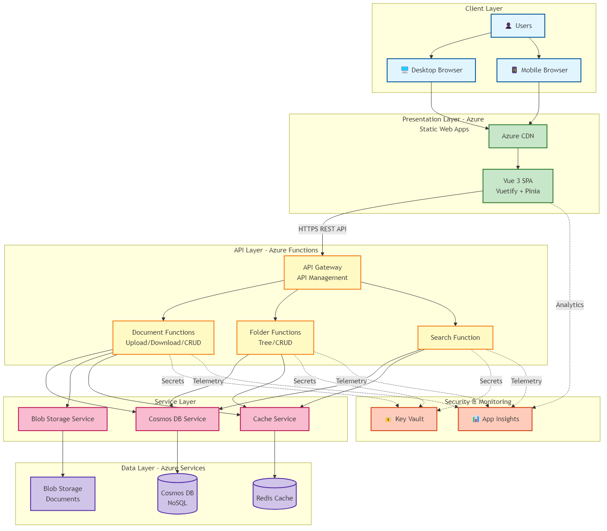

# Mermaid Diagram Image Generation Guide

This guide explains how to convert the Mermaid diagrams in this folder to PNG images.

---

## 📋 Prerequisites

### Required Software

1. **Node.js** (v14 or higher)
   - Download from: https://nodejs.org
   - Verify installation: `node --version`

2. **Mermaid CLI** (mmdc)
   - Install globally: `npm install -g @mermaid-js/mermaid-cli`
   - Verify installation: `mmdc --version`

### Optional (for PowerShell script)
- PowerShell 5.1 or higher (Windows only)

---

## 🚀 Quick Start

### Windows

**Option 1: Batch File (Easiest)**
```cmd
double-click generate-images.bat
```

**Option 2: PowerShell**
```powershell
.\generate-images.ps1
```

**Option 3: Node.js**
```cmd
node generate-images.js
```

### Mac / Linux

**Option 1: Shell Script**
```bash
chmod +x generate-images.sh
./generate-images.sh
```

**Option 2: Node.js**
```bash
node generate-images.js
```

---

## 📂 What Gets Generated

The scripts will:

1. **Scan all markdown files** in the `diagrams/` folder (except README.md)
2. **Extract all mermaid code blocks** from each file
3. **Generate PNG images** for each diagram with naming pattern:
   - `{filename}-1.png`
   - `{filename}-2.png`
   - etc.

### Example Output

From `01-system-architecture.md`:
- `01-system-architecture-1.png` (main architecture diagram)

From `03-sequence-diagrams.md`:
- `03-sequence-diagrams-1.png` (document upload)
- `03-sequence-diagrams-2.png` (document download)
- `03-sequence-diagrams-3.png` (folder tree navigation)
- etc.

### Expected Image Count

Based on current diagrams:
- **01-system-architecture.md**: 1 image
- **02-database-erd.md**: 1 image
- **03-sequence-diagrams.md**: 7 images
- **04-component-diagram.md**: 2 images
- **05-data-flow-diagram.md**: 5 images
- **06-state-diagrams.md**: 6 images
- **07-user-flow-diagrams.md**: 6 images
- **08-deployment-diagram.md**: 3 images
- **09-api-map.md**: 2 images

**Total: ~33 PNG images**

---

## 🛠️ Script Details

### generate-images.js (Node.js)

**Features**:
- Cross-platform (Windows, Mac, Linux)
- Extracts mermaid blocks using regex
- Generates transparent PNG images (2048x2048 max)
- Cleans up temporary files
- Provides detailed progress output

**Configuration**:
```javascript
// Image settings (in script)
-b transparent    // Transparent background
-w 2048           // Max width 2048px
-H 2048           // Max height 2048px
```

### generate-images.ps1 (PowerShell)

**Features**:
- Windows-optimized
- Color-coded output
- Error handling
- Automatic cleanup

**Usage**:
```powershell
# Run with execution policy (if needed)
Set-ExecutionPolicy -Scope Process -ExecutionPolicy Bypass
.\generate-images.ps1
```

### generate-images.bat (Windows Batch)

**Features**:
- Double-click execution
- Automatic prerequisite checking
- Pause at end to view results

### generate-images.sh (Bash)

**Features**:
- Unix/Linux/Mac compatible
- Prerequisite checking
- Uses Node.js script internally

**Usage**:
```bash
# Make executable (first time only)
chmod +x generate-images.sh

# Run
./generate-images.sh
```

---

## ⚙️ Image Configuration

### Customize Image Settings

Edit the mmdc command in any script to change image settings:

```bash
# Current settings
mmdc -i input.mmd -o output.png -b transparent -w 2048 -H 2048

# Options:
# -b <color>     : Background color (transparent, white, #RRGGBB)
# -w <width>     : Maximum width in pixels
# -H <height>    : Maximum height in pixels
# -t <theme>     : Mermaid theme (default, forest, dark, neutral)
# -s <scale>     : Scale factor (1, 2, 3)
# -f <format>    : Output format (png, svg, pdf)
```

### Examples

**White background**:
```bash
mmdc -i input.mmd -o output.png -b white -w 2048 -H 2048
```

**Dark theme**:
```bash
mmdc -i input.mmd -o output.png -b transparent -w 2048 -H 2048 -t dark
```

**SVG output**:
```bash
mmdc -i input.mmd -o output.svg -b transparent
```

**Higher resolution**:
```bash
mmdc -i input.mmd -o output.png -b transparent -w 4096 -H 4096 -s 2
```

---

## 🐛 Troubleshooting

### Error: "mmdc not found"

**Solution**: Install mermaid-cli globally
```bash
npm install -g @mermaid-js/mermaid-cli
```

If using npm with node version manager (nvm), ensure the global packages are in your PATH.

### Error: "Puppeteer not found" or "Chromium download failed"

**Solution**: Manually install Puppeteer
```bash
npm install -g puppeteer
```

Or use the `--puppeteer-config` option:
```bash
npm install -g @mermaid-js/mermaid-cli --unsafe-perm=true
```

### Error: "Permission denied" (Mac/Linux)

**Solution**: Make script executable
```bash
chmod +x generate-images.sh
```

### Error: "Execution policy" (Windows PowerShell)

**Solution**: Allow script execution for current session
```powershell
Set-ExecutionPolicy -Scope Process -ExecutionPolicy Bypass
```

### Images are too small or cut off

**Solution**: Increase width/height in the script
```javascript
// Change in generate-images.js
-w 4096 -H 4096
```

### Some diagrams fail to generate

**Possible causes**:
1. Invalid Mermaid syntax in markdown
2. Complex diagram exceeds rendering limits
3. Memory issues (try smaller diagrams)

**Solution**: Check the specific mermaid block syntax and simplify if needed.

---

## 🔍 Manual Generation (Single Diagram)

To generate a single diagram manually:

### Step 1: Extract Mermaid Code
Copy the mermaid code from any markdown file (content between \`\`\`mermaid and \`\`\`)

### Step 2: Create .mmd File
Save the mermaid code to a file, e.g., `my-diagram.mmd`

### Step 3: Generate Image
```bash
mmdc -i my-diagram.mmd -o my-diagram.png -b transparent
```

---

## 📦 Alternative Methods

### 1. VS Code Extension

**Extension**: Markdown Preview Mermaid Support
1. Install extension
2. Open markdown file
3. Preview (Ctrl+Shift+V / Cmd+Shift+V)
4. Right-click diagram → "Copy as PNG" or export

### 2. Online Tool

**Website**: https://mermaid.live
1. Copy mermaid code
2. Paste into mermaid.live editor
3. Download as PNG/SVG

### 3. GitHub Rendering

GitHub automatically renders mermaid in markdown files.
- View the markdown file on GitHub
- Take screenshot (not ideal for high quality)

### 4. Mermaid Ink API

Generate images via API:
```
https://mermaid.ink/img/[base64-encoded-mermaid-code]
```

Example:
```bash
# Encode mermaid code to base64
echo "graph TD; A-->B;" | base64

# Use in URL
https://mermaid.ink/img/Z3JhcGggVEQ7IEEtLT5COw==
```

---

## 🎨 Styling Tips

### Custom Colors

Edit mermaid diagrams to use custom colors:



### Themes

Use mermaid themes with `-t` flag:
- `default` - Standard theme
- `forest` - Green theme
- `dark` - Dark theme
- `neutral` - Neutral gray theme

### Custom CSS

Create a CSS file and use with `--cssFile`:
```bash
mmdc -i input.mmd -o output.png --cssFile custom.css
```

---

## 📝 Script Maintenance

### Update All Scripts

If you change image settings, update in all script files:
1. `generate-images.js` (line with mmdc command)
2. `generate-images.ps1` (line with mmdc command)

### Add New Diagram Files

Scripts automatically detect all `.md` files except `README.md`.
No changes needed when adding new diagram files.

### Exclude Files from Generation

Edit the file filter in scripts:
```javascript
// In generate-images.js
.filter(file =>
  file.endsWith('.md') &&
  file !== 'README.md' &&
  file !== 'IMAGE-GENERATION-GUIDE.md'  // Add exclusions here
)
```

---

## 📊 Image Usage

Generated images can be used for:
- **Documentation sites** (GitBook, MkDocs, etc.)
- **Presentations** (PowerPoint, Google Slides)
- **Wikis** (Confluence, Notion)
- **Reports** (PDF exports)
- **Email** (attach images)

### Embedding in Markdown

If you want to use generated images in markdown instead of mermaid code:

```markdown

```

**Trade-offs**:
- ✅ Faster page load (no client-side rendering)
- ✅ Works everywhere (email, PDFs)
- ❌ Harder to maintain (must regenerate on changes)
- ❌ Not version-control friendly (binary files)

**Recommendation**: Keep mermaid code as source of truth, generate images as needed for specific use cases.

---

## 🔄 Automation

### CI/CD Integration

Add to GitHub Actions workflow:

```yaml
name: Generate Diagrams

on:
  push:
    paths:
      - 'diagrams/*.md'

jobs:
  generate:
    runs-on: ubuntu-latest
    steps:
      - uses: actions/checkout@v2

      - name: Setup Node.js
        uses: actions/setup-node@v2
        with:
          node-version: '18'

      - name: Install mermaid-cli
        run: npm install -g @mermaid-js/mermaid-cli

      - name: Generate images
        run: |
          cd diagrams
          node generate-images.js

      - name: Commit images
        run: |
          git config --local user.email "action@github.com"
          git config --local user.name "GitHub Action"
          git add diagrams/*.png
          git commit -m "Auto-generate diagram images" || exit 0
          git push
```

### Pre-commit Hook

Add to `.git/hooks/pre-commit`:

```bash
#!/bin/bash
# Generate diagram images before commit

cd diagrams
node generate-images.js
git add *.png
```

---

## 📚 Additional Resources

- **Mermaid Documentation**: https://mermaid.js.org
- **Mermaid CLI**: https://github.com/mermaid-js/mermaid-cli
- **Mermaid Live Editor**: https://mermaid.live
- **Syntax Guide**: https://mermaid.js.org/intro/syntax-reference.html

---

## ✅ Checklist

Before running scripts:
- [ ] Node.js installed (v14+)
- [ ] mermaid-cli installed globally
- [ ] Verified mmdc command works
- [ ] Reviewed markdown files for mermaid blocks
- [ ] Configured image settings (if needed)

After generation:
- [ ] Check all images generated successfully
- [ ] Verify image quality and size
- [ ] Use images in documentation as needed
- [ ] Commit images if desired (optional)

---

**For questions or issues, refer to the troubleshooting section or check the mermaid-cli documentation.**
