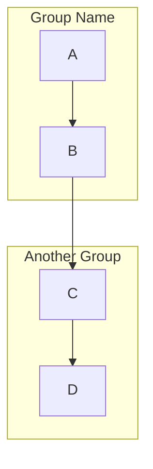
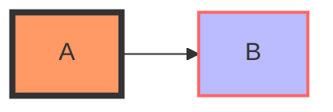
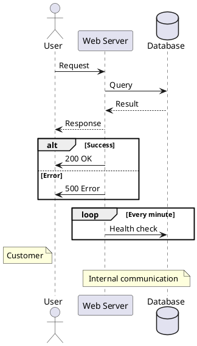
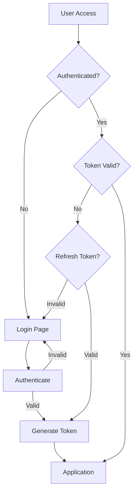
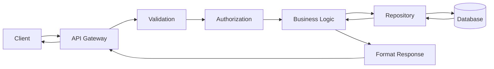
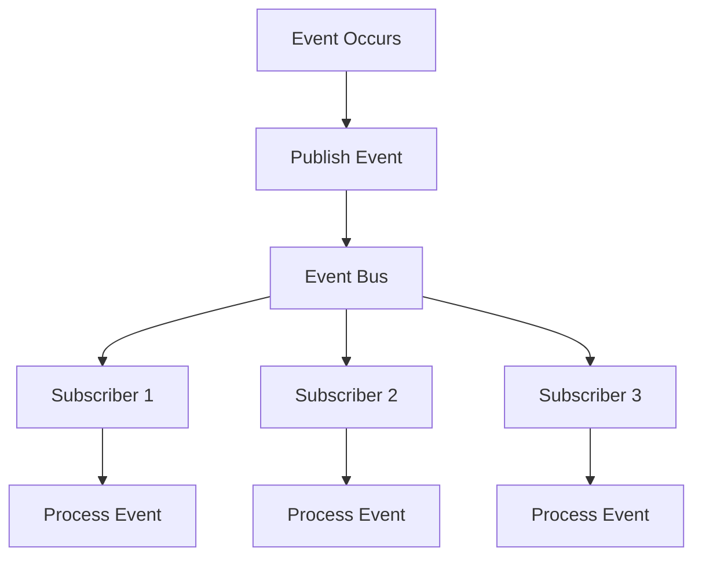
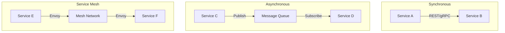

# Application Diagrams & Visuals Creation Guide

**Optimized for LLM-Assisted Generation**

This guide provides structured instructions for creating comprehensive diagrams and visuals for software applications. Optimized for Large Language Models (LLMs) to understand context, generate accurate diagram code, and maintain consistency across documentation.

---

## Table of Contents

1. [Quick Reference Matrix](#quick-reference-matrix)
2. [Diagram Categories & Templates](#diagram-categories--templates)
3. [LLM Prompt Templates](#llm-prompt-templates)
4. [Mermaid Syntax Reference](#mermaid-syntax-reference)
5. [PlantUML Syntax Reference](#plantuml-syntax-reference)
6. [ASCII Diagram Templates](#ascii-diagram-templates)
7. [Context Requirements for Each Diagram](#context-requirements-for-each-diagram)
8. [Generation Best Practices](#generation-best-practices)

---

## Quick Reference Matrix

| Diagram Type | Purpose | When to Use | Required Context | Output Format |
|--------------|---------|-------------|------------------|---------------|
| **System Architecture** | Show overall system components | Initial design, documentation | Components, connections, data flow | Mermaid graph/C4 |
| **ERD** | Database structure | Database design | Tables, fields, relationships | Mermaid erDiagram |
| **Sequence** | Time-based interactions | API flows, user scenarios | Actors, messages, timing | Mermaid sequenceDiagram |
| **Class** | Code structure | OOP design | Classes, methods, relationships | Mermaid classDiagram |
| **User Flow** | User journey | UX design | Steps, decisions, outcomes | Mermaid flowchart |
| **State** | Object lifecycle | State management | States, transitions, events | Mermaid stateDiagram |
| **Deployment** | Infrastructure layout | DevOps planning | Servers, services, networks | Mermaid/ASCII |
| **Component** | Module organization | Architecture design | Modules, dependencies | Mermaid graph |
| **Data Flow** | Information movement | Data architecture | Sources, transformations, sinks | Mermaid flowchart |
| **API Map** | Endpoint structure | API documentation | Routes, methods, parameters | YAML/JSON tree |

---

## Diagram Categories & Templates

### 1. ARCHITECTURE DIAGRAMS

**System Architecture Template**
- Shows high-level system components and their relationships
- Use for: Initial design phase, architecture documentation
- Include: Major components, data flow, external integrations

### 2. DATA & DATABASE DIAGRAMS

**Entity Relationship Diagram Template**
- Shows database entities and their relationships
- Use for: Database design, data modeling
- Include: Tables, fields, primary/foreign keys, cardinality

**Data Flow Diagram Template**
- Shows how data moves through the system
- Use for: Understanding data pipelines, ETL processes
- Include: Data sources, transformations, storage, consumption

### 3. BEHAVIORAL DIAGRAMS

**Sequence Diagram Template**
- Shows time-based interactions between components
- Use for: API flows, authentication flows, user scenarios
- Include: Actors, messages, timing, success/error paths

**State Diagram Template**
- Shows object lifecycle and state transitions
- Use for: State management, workflow modeling
- Include: States, transitions, triggers, guards

**User Flow Diagram Template**
- Shows user journey through the application
- Use for: UX design, feature planning
- Include: Entry points, decisions, actions, outcomes

### 4. STRUCTURAL DIAGRAMS

**Class Diagram Template**
- Shows code structure and relationships
- Use for: OOP design, code architecture
- Include: Classes, methods, properties, inheritance

**Component Diagram Template**
- Shows module organization and dependencies
- Use for: System architecture, module planning
- Include: Components, interfaces, dependencies

### 5. DEPLOYMENT & INFRASTRUCTURE DIAGRAMS

**Cloud Architecture Template**
- Shows cloud infrastructure layout
- Use for: DevOps planning, infrastructure documentation
- Include: Servers, services, networks, regions

**Kubernetes Deployment Template**
- Shows container orchestration setup
- Use for: Container deployment planning
- Include: Pods, services, namespaces, ingress

### 6. API & INTEGRATION DIAGRAMS

**API Endpoint Structure Template**
- Shows API hierarchy and organization
- Use for: API documentation, endpoint planning
- Include: Routes, methods, parameters, responses

**Integration Flow Template**
- Shows external system integrations
- Use for: Integration architecture
- Include: Internal systems, adapters, external services

---

## LLM Prompt Templates

### For Architecture Diagrams

```
Create a [DIAGRAM_TYPE] diagram for a [APPLICATION_TYPE] that:
- Serves [NUMBER] users
- Uses [TECH_STACK]
- Integrates with [EXTERNAL_SERVICES]
- Deployed on [PLATFORM]
- Has requirements: [REQUIREMENTS]

Include:
- All major components
- Data flow directions
- External integrations
- Security boundaries
- Scalability considerations

Output as Mermaid code with:
- Clear labels
- Proper grouping
- Style definitions
- Comments for complex parts
```

### For Database Diagrams

```
Generate an ERD for a [DOMAIN] system with:

Entities:
- [ENTITY_1]: [PURPOSE]
- [ENTITY_2]: [PURPOSE]

Requirements:
- [BUSINESS_RULE_1]
- [BUSINESS_RULE_2]

Include:
- Primary keys (UUID preferred)
- Foreign keys with relationships
- Appropriate data types
- Constraints (NOT NULL, UNIQUE)
- Indexes for performance

Show relationships:
- Cardinality (1:1, 1:N, N:M)
- Optionality (mandatory/optional)
```

### For Sequence Diagrams

```
Create a sequence diagram for [FLOW_NAME]:

Actors:
- [ACTOR_1]: [ROLE]
- [ACTOR_2]: [ROLE]

Flow:
1. [STEP_1]
2. [STEP_2]

Include:
- Success path
- Error handling
- Async operations (if any)
- Optional flows
- Notes for complex logic

Format: Mermaid sequenceDiagram
```

### For State Diagrams

```
Generate a state diagram for [OBJECT/PROCESS]:

Initial state: [STATE]
Final state(s): [STATE(S)]

Possible states:
- [STATE_1]: [DESCRIPTION]
- [STATE_2]: [DESCRIPTION]

Transitions:
- [TRIGGER]: [FROM_STATE] -> [TO_STATE]

Include:
- Guards/conditions
- Actions on transitions
- Entry/exit actions
- Nested states if applicable
```

---

## Mermaid Syntax Reference

### Graph Types
- `graph TD` - Top-Down
- `graph LR` - Left-Right
- `graph BT` - Bottom-Top
- `graph RL` - Right-Left

### Node Shapes
- `A[Rectangle]`
- `B(Rounded)`
- `C([Stadium])`
- `D[[Subroutine]]`
- `E[(Database)]`
- `F((Circle))`
- `G>Asymmetric]`
- `H{Rhombus}`
- `I{{Hexagon}}`
- `J[/Parallelogram/]`
- `K[\Parallelogram Alt\]`
- `L[/Trapezoid\]`
- `M[\Trapezoid Alt/]`

### Arrow Types
- `A --> B` - Arrow
- `C --- D` - Line
- `E -.-> F` - Dotted arrow
- `G -.- H` - Dotted line
- `I ==> J` - Thick arrow
- `K === L` - Thick line
- `M --text--> N` - Labeled arrow

### Subgraphs


### Styling


---

## PlantUML Syntax Reference

### Basic Structure

```plantuml
@startuml
' Comments start with apostrophe
title Diagram Title

' Content here

@enduml
```


### Common Elements


---

## ASCII Diagram Templates

### Box Diagram
```
┌──────────────────────────────────────┐
│         Application Layer            │
├──────────────────────────────────────┤
│         Business Logic               │
├──────────────────────────────────────┤
│         Data Access Layer            │
├──────────────────────────────────────┤
│         Database                     │
└──────────────────────────────────────┘
```

### Tree Structure
```
Project/
├── src/
│   ├── controllers/
│   │   ├── authController.js
│   │   └── userController.js
│   ├── models/
│   │   ├── User.js
│   │   └── Post.js
│   ├── services/
│   │   └── authService.js
│   └── utils/
│       └── validation.js
├── tests/
│   ├── unit/
│   └── integration/
├── package.json
└── README.md
```

### Network Diagram
```
Internet
  │
  ▼
[Firewall]
  │
  ├──[Load Balancer]
  │         │
  │    ┌────┼────┐
  │    │    │    │
  │  [Server 1] [Server 2] [Server 3]
  │
  └──[Database]
     ├──[Primary]
     └──[Replica]
```

### Flow Diagram
```
Start
  │
  ▼
[Input Data]
  │
  ▼
{Valid?}
  │ No
  ├───────> [Show Error] ───> End
  │ Yes
  ▼
[Process]
  │
  ▼
[Save]
  │
  ▼
[Output]
  │
  ▼
End
```

---

## Context Requirements for Each Diagram

### System Architecture
**Required Context:**
- System purpose and goals
- User types and scale
- Technology stack
- Deployment environment
- External dependencies
- Performance requirements
- Security requirements

**Example Context:**
```
System: E-commerce Platform
Users: 100K daily active users
Stack: React, Node.js, PostgreSQL, Redis
Deployment: AWS with auto-scaling
Integrations: Stripe, SendGrid, Google Analytics
Requirements: <100ms response time, 99.9% uptime
```

### ERD/Database Schema
**Required Context:**
- Domain entities
- Business rules
- Data relationships
- Constraints and validations
- Performance considerations
- Data volume expectations

**Example Context:**
```
Domain: Blog Platform
Entities: Users, Posts, Comments, Tags, Categories
Rules:
- Users can have multiple posts
- Posts can have multiple tags
- Comments are hierarchical (replies)
Constraints:
- Email must be unique
- Post slug must be unique
- Comments limited to authenticated users
```

### Sequence Diagrams
**Required Context:**
- Actors/participants
- Process flow steps
- Success scenarios
- Error scenarios
- Timing requirements
- Async vs sync operations

**Example Context:**
```
Flow: User Registration
Actors: User, Frontend, API, Database, Email Service
Steps:
1. User submits form
2. Frontend validates
3. API checks uniqueness
4. API creates user
5. API sends verification email
6. User verifies email
Errors: Duplicate email, Invalid data, Email service failure
```

### State Diagrams
**Required Context:**
- Object/process being modeled
- All possible states
- Triggering events
- Guard conditions
- Actions on transitions
- Business rules for state changes

**Example Context:**
```
Object: Order
States: Created, Paid, Processing, Shipped, Delivered, Cancelled, Refunded
Events: Payment received, Ship order, Mark delivered, Request refund
Rules:
- Can only ship after payment
- Can't cancel after shipping
- Refund only within 30 days
```

---

## Generation Best Practices

### 1. Structure & Organization
When generating diagrams:
- Start with high-level overview
- Add details progressively
- Group related components
- Use consistent naming conventions
- Add clear labels and descriptions

### 2. Visual Clarity
For readable diagrams:
- Limit nodes per diagram (max 15-20)
- Use subgraphs/groups for organization
- Apply consistent styling
- Choose appropriate layout direction
- Add legends for complex diagrams

### 3. Technical Accuracy
Ensure correctness:
- Verify all connections
- Check relationship cardinality
- Validate state transitions
- Confirm API endpoints
- Review security boundaries

### 4. Documentation Integration
For comprehensive docs:
- Include diagram purpose
- Add generation date
- Specify version
- List assumptions
- Provide related diagrams

### 5. Maintenance Guidelines
For long-term use:
- Use version control for diagrams
- Keep source files (not just images)
- Document generation tools
- Update with code changes
- Review quarterly

---

## Validation Checklist

### Before Generation
- [ ] Clear requirements gathered
- [ ] Target audience identified
- [ ] Appropriate diagram type selected
- [ ] Necessary context provided
- [ ] Output format determined

### During Generation
- [ ] Following standard notations
- [ ] Maintaining consistency
- [ ] Adding helpful comments
- [ ] Considering scalability
- [ ] Including error paths

### After Generation
- [ ] Diagram is readable
- [ ] All components included
- [ ] Relationships are correct
- [ ] Labels are clear
- [ ] Styling is consistent
- [ ] Documentation updated

---

## Common Patterns Library

### Authentication Flow


### CRUD Operations Pattern


### Event-Driven Pattern


### Microservices Communication


---

## Output Format Guidelines

### For LLM Generation

When requesting diagrams from an LLM:

1. **Specify exact format:**
   ```
   Output format: Mermaid graph LR
   ```

2. **Request structure:**
   ```
   Include:
   - Subgraphs for grouping
   - Style definitions
   - Comments for clarity
   ```

3. **Define conventions:**
   ```
   Naming: PascalCase for components
   Colors: Blue for external, Green for internal
   ```

4. **Request metadata:**
   ```
   Add:
   - Title comment
   - Version comment
   - Last updated comment
   ```

### For Documentation

```markdown
## Diagram: [Name]

**Purpose:** [What this diagram shows]

**Last Updated:** [Date]

**Version:** [Version number]

```[diagram-code]```

**Key Components:**
- [Component 1]: [Description]
- [Component 2]: [Description]

**Notes:**
- [Important note 1]
- [Important note 2]
```

---

## Troubleshooting Guide

### Common Issues

**1. Diagram Too Complex**
- Solution: Break into multiple diagrams
  - Overview diagram (high-level)
  - Component detail diagram
  - Integration diagram

**2. Unclear Relationships**
- Solution: Add labels and notes
  - Use labeled arrows
  - Add note boxes
  - Include legend

**3. Performance Issues (Large Diagrams)**
- Solution: Use appropriate tools
  - Small diagrams: Mermaid (in-browser)
  - Medium diagrams: PlantUML
  - Large diagrams: Dedicated tools (draw.io, Lucidchart)
  - Very large: Split into modules

**4. Version Control Problems**
- Solution: Use text-based formats
  - Good: Mermaid, PlantUML (text files)
  - Okay: draw.io (XML format)
  - Avoid: Binary image formats for source

---

## Integration with Development Workflow

### 1. Documentation as Code
```yaml
# .github/workflows/docs.yml
name: Generate Diagrams

on:
  push:
    paths: ['docs/diagrams/**']

jobs:
  generate:
    runs-on: ubuntu-latest
    steps:
      - uses: actions/checkout@v2
      - name: Generate Mermaid Diagrams
        uses: neenjaw/mermaid-compile-action@v1
      - name: Generate PlantUML Diagrams
        uses: cloudbees/plantuml-github-action@v1
```

### 2. Pre-commit Hooks
```yaml
# .pre-commit-config.yaml
repos:
  - repo: local
    hooks:
      - id: validate-diagrams
        name: Validate Diagram Syntax
        entry: scripts/validate-diagrams.sh
        language: script
        files: \.(mmd|puml)$
```

### 3. Living Documentation
```javascript
// Example: Auto-generate API diagram from code
const swaggerJsdoc = require('swagger-jsdoc');
const generateMermaidFromSwagger = require('./diagram-generator');

const specs = swaggerJsdoc(options);
const diagram = generateMermaidFromSwagger(specs);
fs.writeFileSync('docs/api-diagram.mmd', diagram);
```

---

**Version:** 1.0.0
**Last Updated:** December 2024

This guide serves as a comprehensive reference for creating application diagrams. Use the templates, patterns, and guidelines to ensure consistent, clear, and maintainable technical documentation.
